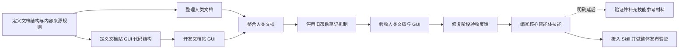

# Query&View 文档站任务图 / Documentation Site Task Graph

**当前状态：** 文档站阶段反馈与核心 Skill 均已验收；正在把同一份 Skill 接入文档站并执行整体发布验证。
**当前前沿：** “接入 Skill 并做整体发布验证”正在执行。

## 计划任务

| 任务 | 独立交付物 | 依赖 | 状态 |
|---|---|---|---|
| 定义文档结构与内容来源规则 | 已交付 10 页中英文页面地图、README 生成与同步契约、案例占位符、单一帮助入口变更表、离线规则和 GUI 内容读取契约。 | 用户已确认进入方案阶段。 | 已验收；见 `nodes/define-doc-structure/DOC-STRUCTURE.md` |
| 整理人类文档 | 已建立对应的中英文 docs 页面与术语表，生成并同步检查 README，将图片与开发笔记迁移到约定位置。 | 已验收的文档结构与内容来源规则。 | 已验收；见 `nodes/write-human-docs/TASK-NODE.SPEC.md` |
| 定义文档站 GUI 代码结构 | 已交付 `docs-site.LAND.md`：确定 GUI 的文件边界、依赖方向、Tab 生命周期、状态化内容读取、渲染和 SiYuan 样式边界。 | 已验收的文档结构与人类文档。 | 已验收；见 `nodes/shape-docs-gui/docs-site.LAND.md` |
| 开发文档站 GUI | 已实现桌面端文档站：本地页面读取、侧边栏、语言回退、Lute 只读渲染、复制、API 类型声明工具条和 SiYuan 样式。 | 已验收的 GUI 代码结构。 | 已验收；见 `nodes/build-docs-gui/TASK-NODE.SPEC.md` |
| 整合人类文档 | GUI 已读取已整理的指导、案例和 API 导览；完整类型声明可打开或下载；构建确认离线材料随插件打包。真实 SiYuan Tab 体验留给最终验证。 | 已验收的人类文档、开发文档站 GUI。 | 已完成（静态验证）；运行时验证延后至最终任务。 |
| 停用旧帮助笔记机制 | 已移除旧帮助笔记、独立 Examples、d.ts 顶栏菜单和旧设置；保留基础模板与已有帮助笔记，不操作用户数据。 | 已完成的人类文档整合。 | 已验收；见 `nodes/retire-legacy-help/TASK-NODE.SPEC.md` |
| 验收人类文档与 GUI | 自动验证文档、GUI、离线打包和旧帮助行为均通过；运行时检查清单已生成，真实 SiYuan Tab 验证留给最终人工验收。 | 已验收的旧帮助机制退役。 | 已验收（自动验证）；见 `nodes/verify-docs-gui/` |
| 修复阶段验收反馈 | 已移除站内语言切换，`zh_CHT` 使用中文文案与中文 docs，代码块/图片原生控件按上下文删除，任务复选框保留，基本概念改用本地 SVG。 | 用户完成第一轮运行时阶段验收。 | 已验收；见 `nodes/fix-runtime-feedback/` |
| 编写核心智能体技能 | 已交付英文自包含 `SKILL.md`；API 名称按规范名、合法别名和未支持名称分类，并由 receiver-specific 类型/实现验证固定。 | 已验收的阶段反馈修复。 | 已验收；见 `nodes/write-core-skill/` |
| 验证并补充技能参考材料 | 实测目标 Agent 能否通过文件读取工具访问 Skill 安装目录中的参考文件；可行时再加入 `references/`，不可行时保持核心 Skill 自包含并记录限制。 | 编写核心智能体技能。 | 明确延后；不阻塞本轮发布验证 |
| 接入 Skill 并做整体发布验证 | 文档站显示同一份核心 Skill 内容；验证插件内文档站、核心 Skill和打包结果符合目标规格。 | 已验收的核心智能体技能。 | 执行中；见 `nodes/integrate-skill-release/` |

## 任务推进规则

表中的每一项都是以交付物为单位的计划任务，不是已经批准的编码工作。某项任务只有在依赖满足、仍有必要执行且被主 Agent 转为执行任务后，才会在 `nodes/` 下获得自己的 `TASK-NODE.SPEC.md`。

当前执行任务：`nodes/integrate-skill-release/TASK-NODE.SPEC.md`。
