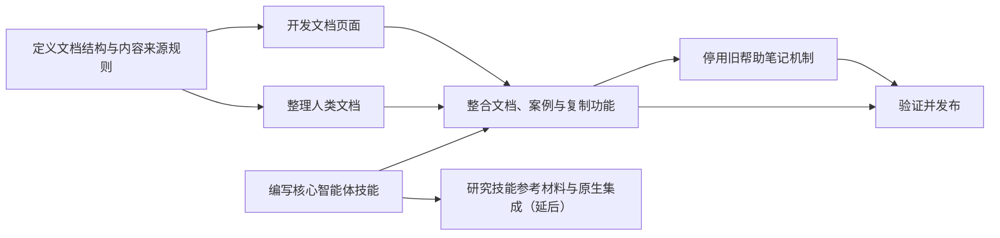

# Query&View 文档站任务图 / Documentation Site Task Graph

**当前状态：** 用户可见需求已记录；尚未开始任何生产代码任务。
**当前前沿：** 等待用户确认进入方案阶段后，可并行开始“定义文档结构与内容来源规则”和“编写核心智能体技能”。

## 计划任务

| 任务 | 独立交付物 | 依赖 | 状态 |
|---|---|---|---|
| 定义文档结构与内容来源规则 | 一份可供开发和写作共同使用的页面地图：主页任务入口、侧边栏页面、每页对应的内容来源、语言规则、帮助入口变更表，以及离线静态材料规则。 | 用户确认进入方案阶段。 | 等待用户反馈 |
| 编写核心智能体技能 | 一份自包含的 `SKILL.md`，说明 Agent 如何编写和查证 Query&View 代码；不依赖文档页面或技能参考材料。 | 用户确认进入方案阶段；现有 README、案例和类型声明。 | 等待用户反馈 |
| 开发文档页面 | 可在 SiYuan 独立 Tab 中打开的文档站框架，具备页面导航和按应用语言选择内容的行为。 | 定义文档结构与内容来源规则。 | 等待 |
| 整理人类文档 | 以 README 作为唯一维护来源，整理可供外部页面与插件内文档站共同使用的说明内容。 | 定义文档结构与内容来源规则。 | 等待 |
| 整合文档、案例与复制功能 | 文档站显示指导、案例、API 导览和核心智能体技能；案例与模板可复制，完整类型声明可打开或下载。 | 开发文档页面、整理人类文档、编写核心智能体技能。 | 等待 |
| 停用旧帮助笔记机制 | 帮助入口不再创建或更新帮助笔记；已有笔记保留原状；过期设置和入口按已确定的变更表处理。 | 整合文档、案例与复制功能。 | 等待 |
| 验证并发布 | 验证文档站的用户行为、语言选择、内容一致性、离线静态材料、案例复制和旧帮助笔记行为。 | 整合文档、案例与复制功能；停用旧帮助笔记机制。 | 等待 |
| 研究技能参考材料与原生集成 | 一份关于 SiYuan 原生 Agent、MCP、Skill 安装/调用及 `references/` 加载方式的决策材料；不直接加入当前功能。 | 核心智能体技能。 | 延后 |

## 任务推进规则

表中的每一项都是以交付物为单位的计划任务，不是已经批准的编码工作。某项任务只有在依赖满足、仍有必要执行且被主 Agent 转为执行任务后，才会在 `nodes/` 下获得自己的 `TASK-NODE.SPEC.md`。

当前没有执行任务。
