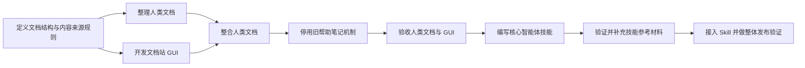

# Query&View 文档站任务图 / Documentation Site Task Graph

**当前状态：** 文档结构与内容来源规则已验收；人类文档整理正在执行。
**当前前沿：** “整理人类文档”正在执行；“开发文档站 GUI”已就绪。

## 计划任务

| 任务 | 独立交付物 | 依赖 | 状态 |
|---|---|---|---|
| 定义文档结构与内容来源规则 | 已交付 10 页中英文页面地图、README 生成与同步契约、案例占位符、单一帮助入口变更表、离线规则和 GUI 内容读取契约。 | 用户已确认进入方案阶段。 | 已验收；见 `nodes/define-doc-structure/DOC-STRUCTURE.md` |
| 整理人类文档 | 建立对应的中英文 docs 页面和术语表，吸收现有 README 教程、案例导览和 API 导览；生成并提交中英文 README，提供同步检查。 | 已验收的文档结构与内容来源规则。 | 执行中；见 `nodes/write-human-docs/` |
| 开发文档站 GUI | 在现有自定义 Tab 方案上用原生 TypeScript/DOM 实现桌面文档站，使用 Lute、SiYuan CSS class/变量，具备侧边栏、页面导航、语言选择和复制操作。 | 已验收的文档结构与内容来源规则。 | 就绪 |
| 整合人类文档 | GUI 显示已整理的指导、案例和 API 导览；完整类型声明可打开或下载；离线材料与插件版本一致。 | 整理人类文档、开发文档站 GUI。 | 等待 |
| 停用旧帮助笔记机制 | 只保留一个帮助菜单打开文档站；移除独立 Examples、d.ts 快捷菜单和旧帮助设置；保留基础模板和已有帮助笔记。 | 整合人类文档。 | 等待 |
| 验收人类文档与 GUI | 验证桌面用户路径、中英文覆盖与术语一致性、README 同步、离线材料、案例复制和旧帮助行为；确认未破坏移动端已有 Query View 块渲染。 | 停用旧帮助笔记机制。 | 等待 |
| 编写核心智能体技能 | 一份自包含的 `SKILL.md`，基于已验收的文档、案例和类型声明说明 Agent 如何编写及查证 Query&View 代码。 | 验收人类文档与 GUI。 | 等待 |
| 验证并补充技能参考材料 | 实测目标 Agent 能否通过文件读取工具访问 Skill 安装目录中的参考文件；可行时再加入 `references/`，不可行时保持核心 Skill 自包含并记录限制。 | 编写核心智能体技能。 | 等待 |
| 接入 Skill 并做整体发布验证 | 文档站显示同一份核心 Skill 内容；验证插件内文档站、核心 Skill、可选参考材料和打包结果符合目标规格。 | 验证并补充技能参考材料。 | 等待 |

## 任务推进规则

表中的每一项都是以交付物为单位的计划任务，不是已经批准的编码工作。某项任务只有在依赖满足、仍有必要执行且被主 Agent 转为执行任务后，才会在 `nodes/` 下获得自己的 `TASK-NODE.SPEC.md`。

当前执行任务：`nodes/write-human-docs/TASK-NODE.SPEC.md`。
