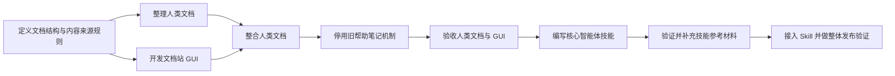

# Query&View 文档站任务图 / Documentation Site Task Graph

**当前状态：** 用户可见需求已记录；尚未开始任何生产代码任务。
**当前前沿：** 等待用户确认进入方案阶段后，开始“定义文档结构与内容来源规则”。

## 计划任务

| 任务 | 独立交付物 | 依赖 | 状态 |
|---|---|---|---|
| 定义文档结构与内容来源规则 | 一份可供开发和写作共同使用的页面地图：主页任务入口、侧边栏页面、每页对应的内容来源、语言规则、帮助入口变更表，以及离线静态材料规则。 | 用户确认进入方案阶段。 | 等待用户反馈 |
| 整理人类文档 | 以 README 作为唯一维护来源，整理可供外部页面与插件内文档站共同使用的说明、案例导览和 API 导览。 | 定义文档结构与内容来源规则。 | 等待 |
| 开发文档站 GUI | 可在 SiYuan 独立 Tab 中打开的文档站界面，具备侧边栏、页面导航、按应用语言选择内容和复制操作。 | 定义文档结构与内容来源规则。 | 等待 |
| 整合人类文档 | GUI 显示已整理的指导、案例和 API 导览；完整类型声明可打开或下载；离线材料与插件版本一致。 | 整理人类文档、开发文档站 GUI。 | 等待 |
| 停用旧帮助笔记机制 | 帮助入口不再创建或更新帮助笔记；已有笔记保留原状；过期设置和入口按已确定的变更表处理。 | 整合人类文档。 | 等待 |
| 验收人类文档与 GUI | 验证用户路径、语言选择、内容覆盖、离线静态材料、案例复制和旧帮助笔记行为，为 Skill 提供稳定材料。 | 停用旧帮助笔记机制。 | 等待 |
| 编写核心智能体技能 | 一份自包含的 `SKILL.md`，基于已验收的文档、案例和类型声明说明 Agent 如何编写及查证 Query&View 代码。 | 验收人类文档与 GUI。 | 等待 |
| 验证并补充技能参考材料 | 实测目标 Agent 能否通过文件读取工具访问 Skill 安装目录中的参考文件；可行时再加入 `references/`，不可行时保持核心 Skill 自包含并记录限制。 | 编写核心智能体技能。 | 等待 |
| 接入 Skill 并做整体发布验证 | 文档站显示同一份核心 Skill 内容；验证插件内文档站、核心 Skill、可选参考材料和打包结果符合目标规格。 | 验证并补充技能参考材料。 | 等待 |

## 任务推进规则

表中的每一项都是以交付物为单位的计划任务，不是已经批准的编码工作。某项任务只有在依赖满足、仍有必要执行且被主 Agent 转为执行任务后，才会在 `nodes/` 下获得自己的 `TASK-NODE.SPEC.md`。

当前没有执行任务。
