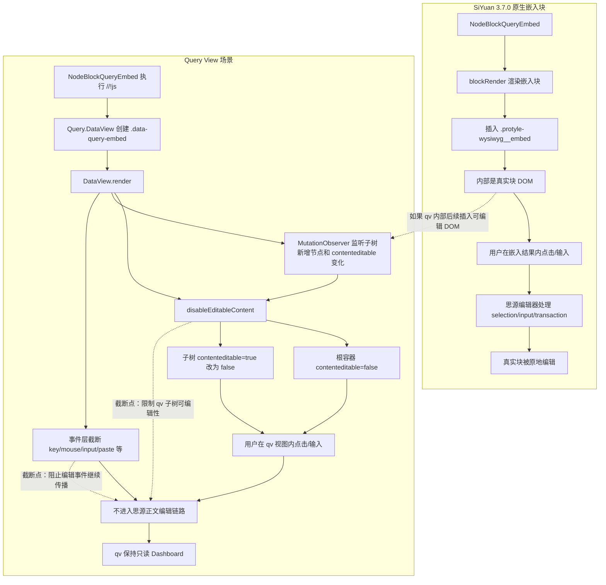

## Problem statement

SiYuan 3.7.0 增强了嵌入块能力：嵌入块支持原地编辑，不再只能通过浮窗编辑。这改变了嵌入块渲染结果在编辑器中的交互模型。变更入口见 https://github.com/siyuan-note/siyuan/blob/c72ca4cd09019e5f64afdee8f8c6ec5ef34858db/app/changelogs/v3.7.0/v3.7.0.zh-CN.md#L106 。

Query View（qv）的核心使用场景是：用户在 JS 嵌入块中执行查询逻辑，然后用 `Query.DataView(protyle, item, top)` 在当前嵌入块内插入一个自定义视图容器。这个容器被设计为“理论上只读”的 Dashboard，而不是思源正文编辑区域。

因此，SiYuan 3.7.0 的变化带来的问题是：如果 qv 视图内部或其嵌入展示组件被思源识别为可编辑内容，用户输入事件可能进入思源编辑器链路，导致 qv 的展示内容被误当作正文块编辑，破坏 qv 的只读展示假设。

本次目标: 在 qv 场景下维持 qv 视图的只读语义, 不破坏原生嵌入块的可编辑特性。

## 上游变化

SiYuan 现在在渲染嵌入块时，会把查询结果插入到 `.protyle-wysiwyg__embed` 容器内，证据见 https://github.com/siyuan-note/siyuan/blob/c72ca4cd09019e5f64afdee8f8c6ec5ef34858db/app/src/protyle/render/blockRender.ts#L120 ：

- https://github.com/siyuan-note/siyuan/blob/c72ca4cd09019e5f64afdee8f8c6ec5ef34858db/app/src/protyle/render/blockRender.ts#L12 中，`NodeBlockQueryEmbed` 会被 `blockRender()` 处理。
- 渲染结果结构类似：

```html
<div data-type="NodeBlockQueryEmbed" data-node-id="..." class="render-node">
  <div class="protyle-icons">...</div>
  <div class="protyle-wysiwyg__embed" data-id="...">
    <!-- 查询到的真实块内容 -->
  </div>
  <div class="protyle-attr" contenteditable="false">...</div>
</div>
```

关键点是：嵌入块外层 `NodeBlockQueryEmbed` 仍然是一个特殊块，但 `.protyle-wysiwyg__embed` 内部的结果块是普通块 DOM。它们会参与编辑器的常规编辑模型。

SiYuan 同时增加了边界处理，例如：

- https://github.com/siyuan-note/siyuan/blob/c72ca4cd09019e5f64afdee8f8c6ec5ef34858db/app/src/protyle/wysiwyg/getBlock.ts#L101 中的 `getContenteditableElement()` 对 `NodeBlockQueryEmbed` 返回 `undefined`，表示嵌入块外层本身不是普通可编辑块。
- https://github.com/siyuan-note/siyuan/blob/c72ca4cd09019e5f64afdee8f8c6ec5ef34858db/app/src/protyle/wysiwyg/getBlock.ts#L140 中的 `isNotEditBlock()` 仍把 `NodeBlockQueryEmbed` 视为不可编辑块。
- https://github.com/siyuan-note/siyuan/blob/c72ca4cd09019e5f64afdee8f8c6ec5ef34858db/app/src/protyle/wysiwyg/enter.ts#L23 中的 `enter()` 在 `.protyle-wysiwyg__embed` 内部阻止部分结构性换行行为。
- https://github.com/siyuan-note/siyuan/blob/c72ca4cd09019e5f64afdee8f8c6ec5ef34858db/app/src/protyle/wysiwyg/transaction.ts#L118 和 https://github.com/siyuan-note/siyuan/blob/c72ca4cd09019e5f64afdee8f8c6ec5ef34858db/app/src/protyle/wysiwyg/transaction.ts#L377 显示 transaction 流程会在嵌入结果相关块变化时刷新 `.protyle-wysiwyg__embed` 或整个嵌入块。

这说明上游的目标不是让嵌入块外层变成普通正文块，而是允许用户在嵌入结果内部直接编辑真实块内容，同时保护嵌入块边界。

## qv 之前为什么无法完全应对

qv 之前已经有多层只读保护：

1. qv 构造时创建 `.data-query-embed` 容器，并插入到当前 `NodeBlockQueryEmbed` 内。
2. `DataView.render()` 会给 qv 根容器设置 `contenteditable="false"`。
3. `DataView.render()` 会扫描当时存在的 `[contenteditable="true"]` 子节点，并改成 `false`。
4. qv 根容器会截断 `compositionstart/end`、`mousedown`、`mouseup`、`keydown`、`keyup`、`input`、`copy`、`cut`、`paste` 等事件。
5. qv 还在 protyle 根上捕获 `keydown`，当 selection 位于 `.data-query-embed` 内时阻止事件继续传播。

这些机制在旧版嵌入块模型下基本足够，因为 qv 视图通常在一次 `render()` 中完成 DOM 生成。

3.7.0 后的 gap 在于：

- 上游嵌入结果现在具备更强的原地编辑能力，qv 内部一旦出现可编辑 DOM，就更可能进入思源编辑链路。
- qv 原来的 `[contenteditable="true"]` 清理只发生在 `render()` 当下，是一次性修正。
- qv 支持自定义组件、异步组件和后续 DOM 插入。后续插入的节点如果带有 `contenteditable="true"`，旧逻辑不会再次清理。
- `EmbedNodes` 这类组件会调用 `/api/search/getEmbedBlock` 拿到思源块 HTML。虽然组件自身也会把已有 `[contenteditable]` 改成 `false`，但这依然依赖组件本地实现；qv 根层缺少统一兜底。

所以问题不是“旧 qv 完全没有禁编辑”，而是“旧 qv 的禁编辑是一次性的、分散的，无法覆盖 qv 生命周期中后续出现的可编辑 DOM”。

## 解决思路

解决目标：在 qv 场景下维持只读语义，同时尽量不干扰 SiYuan 原生嵌入块的新能力。

采用的策略是：在 qv 自己的根容器层做只读兜底，而不是复用或伪装成 SiYuan 的 `.protyle-wysiwyg__embed`。

没有选择给 qv 容器加 `.protyle-wysiwyg__embed`，原因是这个类在 SiYuan 内部不仅是样式标记，也参与编辑器行为判断。强行加上可能让 qv 进入上游嵌入块边界逻辑，例如 Enter、选择、transaction 刷新等路径，带来不必要副作用。

最终方案：

1. 在 `DataView` 内新增统一方法 `disableEditableContent()`：
   - 保证 qv 根容器 `contenteditable="false"`。
   - 把 qv 子树内所有 `[contenteditable="true"]` 改为 `false`。
2. 在 `DataView.render()` 中调用该方法，替代原来的内联一次性扫描。
3. 扩展 qv 已有 `MutationObserver`：
   - 从只观察当前嵌入块的直接子节点，改为观察子树。
   - 继续监听 `style`，用于保留原有高度修复逻辑。
   - 新增监听 `contenteditable` 属性变化。
   - 当 qv 子树新增节点或出现 `contenteditable` 属性变化时，重新执行 `disableEditableContent()`。
4. 修正 dispose 顺序：避免提前把 `this.observer` 置空，确保 observer disposer 能正常 `disconnect()`。

这个方案的边界是 qv 根容器 `.data-query-embed`。它不改变普通 SiYuan 嵌入块，也不改变用户未使用 `Query.DataView()` 的 JS 嵌入块。

### 流程对比：截断点在哪里



图中的两个截断点分别对应 DOM 属性层和事件层：

- `disableEditableContent()` 负责把 qv 子树压成不可编辑，避免后续插入的块 HTML 被思源当作正文编辑目标。
- qv 既有事件拦截继续阻止输入、粘贴、键盘等事件从 `.data-query-embed` 传播到思源编辑器。


## 解决方案可用性置信度评估

置信度：较高。

理由：

- qv 的设计语义明确：`DataView` 是只读 Dashboard；本方案强化的是既有语义，而不是引入新语义。
- 修改点位于 qv 自有容器层，不依赖 SiYuan 上游内部私有类的行为契约。
- 方案覆盖了旧逻辑的主要缺口：后续异步插入或属性变化产生的可编辑 DOM。
- 原有事件截断机制仍保留；本方案只是补强 `contenteditable` 层，形成 DOM 属性与事件层的双重保护。
- 构建验证通过：`npm run build` 可完成，仅出现既有 Sass legacy API 与 Rollup exports 警告。

仍然保留的不确定性：

- SiYuan 未来如果改变嵌入块 DOM 插入位置，qv 构造函数中 `lastElementChild.insertAdjacentElement("beforebegin", ...)` 可能需要重新适配。
- SiYuan 未来如果绕过 DOM `contenteditable` 属性，直接根据块结构或 selection 状态处理编辑事件，qv 可能需要进一步加强事件层拦截。

这些不确定性来自上游编辑器实现演进，不影响当前补丁对 3.7.0 变化的针对性。

## 潜在风险分析

### 1. 自定义组件中的输入控件交互受限

qv 文档本来已经建议不要在 DataView 中写大量交互性组件。该方案会把 qv 子树内的 `contenteditable="true"` 改为 `false`，因此依赖 contenteditable 的自定义组件会被禁用编辑。

这与 qv 的只读 Dashboard 定位一致，但如果用户确实写了富文本输入型自定义组件，会受到影响。

普通 `input`、`textarea` 不依赖 `contenteditable="true"`，本方案不会直接改它们的 `value` 或 `disabled` 状态；但原有事件截断逻辑本身就可能影响复杂输入场景。

### 2. MutationObserver 观察范围扩大

观察范围从 `subtree: false` 扩大到 `subtree: true`，意味着 qv 内部 DOM 变化会触发更多 observer 回调。

风险可控，原因是：

- qv 容器通常规模有限。
- 回调只处理 `childList`、`style`、`contenteditable`。
- `disableEditableContent()` 只查询 `[contenteditable="true"]`，并且根容器设置前有值检查，避免无意义重复写入。

如果某个 qv 自定义组件高频、大量重建 DOM，可能有轻微性能成本；这属于 qv 复杂自定义视图本身的成本放大，不是普通使用路径。

### 3. 与未来 SiYuan 嵌入块渲染变更的兼容性

当前 qv 是插入到 `NodeBlockQueryEmbed` 内部、`protyle-attr` 前面。若 SiYuan 未来改变嵌入块子节点结构，qv 的插入位置和生命周期监听可能需要适配。

本方案没有增加对 `.protyle-wysiwyg__embed` 的依赖，反而降低了与上游内部类耦合的风险。

### 4. 无法阻止 qv 外部的原生嵌入块编辑

本方案只作用于 `.data-query-embed` qv 容器。用户在普通 SQL 嵌入块或未使用 `DataView` 的 JS 嵌入块中，仍会获得 SiYuan 3.7.0 的原地编辑能力。

这是预期边界，不是缺陷。
