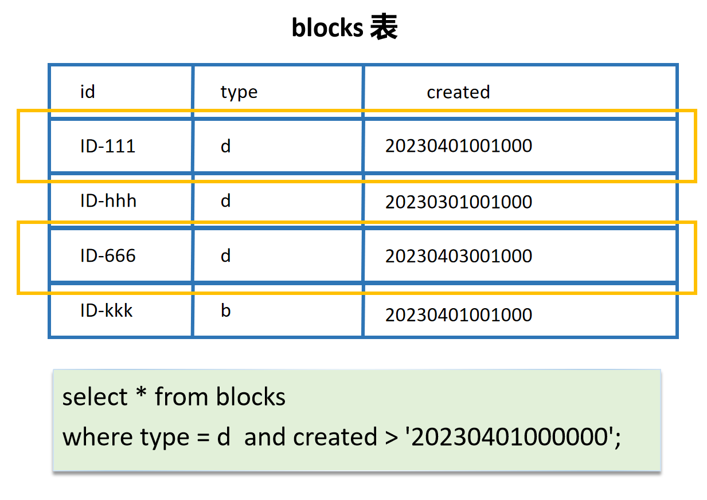

> 🥺 This README document was originally written in Chinese (see README_zh_CN.md). Due to its length, I used a language model (LLM) to translate it into English. If you find any issues or areas that need improvement, please let me know, and I will be happy to fix them.
>
> Additionally, this document contains a large number of images, and I unfortunately do not have the time or energy to migrate them to English version. I appreciate your understanding in this matter.

The embedded block feature of SiYuan supports querying using JavaScript syntax. Previously, the [Basic Data Query](https://github.com/zxhd863943427/siyuan-plugin-data-query) plugin developed by Zxhd enhanced the capabilities of JavaScript queries. This plugin builds on that foundation, adjusts the API structure, adds several new features, making JavaScript queries in SiYuan simpler and more convenient. It also optimizes the DataView interface, supporting richer and more customizable data display functions.

⚠️ **Note**: This help document assumes that users have a basic understanding of JavaScript syntax concepts (at least basic variables, control flow, function calls, async/await).

> 🔔 This help document is quite long, and viewing it on the installation page may be inconvenient.
>
> You can download it and click the "Help Document" button in the top-left menu. The plugin will automatically create a help document within SiYuan.
>
> ​​

## 0. Quick Overview of Features

💡 This plugin can provide the following features (here's a general overview, detailed usage will be explained later):

1️⃣ Use the Query API for embedded block/SQL queries.

Example: Query sub-documents of a specified document ID and display only the first three documents:

​​

2️⃣ Use the DataView object to customize the rendering of embedded block content.

Example: Query backlinks of the current document and render them as a list of block links in the embedded block.

​​

Example: Create dynamic document content using JavaScript.

​​

And more rich rendering components.

​​

​​

3️⃣ Simplify the processing and access of query results.

The results obtained using the Query API have some additional convenient properties beyond the basic block attributes. For example, in the following example, we can directly use `aslink`​ to get a block's SiYuan link.

​​

4️⃣ Edit the code of embedded blocks in an external code editor and automatically update the source code as it is edited externally.

​​

## 1. Basic Concepts: What is a JS Embedded Block?

SiYuan's default embedded blocks use SQL syntax to query blocks, which are then automatically rendered into content.

```sql
select * from blocks order by random() limit 1;
```

A JS embedded block is a special usage where, when the content of the embedded block starts with `//!js`​, SiYuan treats the following code as JavaScript and executes it automatically.

A JS embedded block's code is passed the following variables:

* Protyle: The protyle object of the document where the embedded block is located.
* item: The HTML element object of the embedded block itself.
* top: A special identifier, usually can be ignored.

The code of a JS embedded block theoretically needs to **return a list of Block IDs** (`BlockID[]`​), and the blocks corresponding to these IDs will be rendered in the embedded block.

You can try copying the following code into an embedded block; it will render the document where the embedded block is located.

```js
//!js
return [protyle.block.rootID]
```

💡 This plugin provides a series of features to enhance the functionality of JS embedded blocks. The core of the plugin is to pass a `Query`​ API within the embedded block, with the following relationship:


For the complete interface file, please visit: [https://github.com/frostime/sy-query-view/blob/main/public/types.d.ts](https://github.com/frostime/sy-query-view/blob/main/public/types.d.ts)

## 2. Basic Usage

### Using Query for SQL Queries

The simplest query using this plugin is as follows. Here:

* ​`Query`​ object is the API object exposed by the plugin.
* ​`Query.backlink`​ represents querying the backlinks of a specific document.
* ​`protyle.block.rootID`​ is the ID of the document where the embedded block is located.
* ​`blocks`​ is the list of blocks (`Block[]`​) obtained from the query.
* ​`block.pick('id')`​ represents extracting the `id`​ attribute of each block to form a new list, which is then returned to SiYuan.

So this code's function is: <u>Query all backlinks of the current document.</u>

```js
//!js
const query = async () => {
  let blocks = await Query.backlink(protyle.block.rootID);
  return block.pick('id'); // Special utility function, will be introduced later; equivalent to blocks.map(b => b.id);
}
return query();
```

> Note: Since this code uses async/await statements, the await-related code must be wrapped in an async function and cannot be placed directly outside.

It's easy to see that since the code can automatically obtain the ID of the document where it is located via `protyle.block.rootID`​, it eliminates the need to manually modify the `root_id`​ field every time you write an embedded block. This allows you to write the code once and run it anywhere—a small advantage of JS queries.

​`Query.backlink`​ essentially wraps SiYuan's SQL queries (if you are not familiar with SiYuan's SQL queries, please read [https://ld246.com/article/1683355095671](https://ld246.com/article/1683355095671)). Similar functions include the following:

```ts
/**
 * Search blocks by tags
 * @param tags - Tags to search for; can provide multiple tags
 * @returns Array of blocks matching the tags
 * @example
 * Query.tag('tag1') // Search for blocks with 'tag1'
 * Query.tag(['tag1', 'tag2'], 'or') // Search for blocks with 'tag1' or 'tag2'
 * Query.tag(['tag1', 'tag2'], 'and') // Search for blocks with 'tag1' and 'tag2'
 */
tag: (tags: string | string[], join?: "or" | "and", limit?: number) => Promise<IWrappedList<IWrappedBlock>>;
/**
 * Find unsolved task blocks
 * @param after - After which the blocks were udpated
 * @param limit - Maximum number of results
 * @returns Array of unsolved task blocks
 * @example
 * Query.task()
 * Query.task('2024101000')
 * Query.task(Query.utils.thisMonth(), 32)
 */
task: (after?: string, limit?: number) => Promise<IWrappedList<IWrappedBlock>>;
/**
 * Randomly roam blocks
 * @param limit - Maximum number of results
 * @param type - Block type
 * @returns Array of randomly roamed blocks
 */
random: (limit?: number, type?: BlockType) => Promise<IWrappedList<IWrappedBlock>>;
/**
 * Gets the daily notes document
 * @param notebook - Notebook ID, if not specified, all daily notes documents will be returned
 * @param limit - Maximum number of results
 * @returns Array of daily notes document blocks
 */
dailynote: (notebook?: NotebookId, limit?: number) => Promise<IWrappedList<IWrappedBlock>>;
/**
 * Gets child documents of a block
 * @param b - Parent block or block ID
 * @returns Array of child document blocks
 */
childDoc: (b: BlockId | Block) => Promise<Block[]>;
keyword: (keywords: string | string[], join?: "or" | "and") => Promise<IWrappedList<IWrappedBlock>>;
/**
 * Search the document that contains all the keywords
 * @param keywords
 * @returns The document blocks that contains all the given keywords
 */
keywordDoc: (keywords: string | string[], join?: "or" | "and") => Promise<any[]>;
```

These functions can be accessed directly via `Query`​. The most general one is `Query.sql`​, which simply takes the SQL query statement as input.

> 🔔 **Note**: The above functions may not include all query APIs. To view the complete interface, please visit [https://github.com/frostime/sy-query-view/blob/main/public/types.d.ts](https://github.com/frostime/sy-query-view/blob/main/public/types.d.ts).

### Basic Usage of DataView

Although the above operations use JavaScript, they seem to be no different from native embedded blocks in essence—the results are still rendered by SiYuan. However, if you use the DataView feature, you can render the queried blocks into various different views.

In this section, we will first introduce three basic view components:

1. List
2. Table
3. Markdown text

🔔 For advanced usage of these components and more complex components, please refer to the "Advanced Usage" section later.

#### DataView.list

First, here is a basic example. Compared to the JS query above, three changes have been made here: 1) Declare a DataView object at the beginning; 2) After querying `blocks`​, use the `dv.addlist`​ API; 3) Remove `return`​ and replace it with `dv.render()`​.

```js
//!js
const query = async () => {
  let dv = Query.DataView(protyle, item, top); // 1. Add this line at the beginning, note that protyle, item, top are fixed parameters
  let blocks = await Query.random(5);
  dv.addlist(blocks); // 2. Call dv.addlist to add a list view
  dv.render(); // 3. Remove return, end with dv.render()
}
return query();
```

With the above code, we can display the blocks obtained from the SQL query as a list in the embedded block, as shown below:

​​

By default, each list item is a block link, which can be hovered over to view and clicked to jump.

​​

In the second parameter of the list function, you can pass some options:

```ts
{
    type?: 'u' | 'o'; // u for unordered list, o for ordered list; default is u
    columns?: number; // After passing an integer, it will be displayed in columns
    renderer?: (b: T) => string | number | undefined | null; // Renderer function, the returned value will be treated as markdown text
}
```

For example, let's display the list as a double-column, ordered list; and we provide a renderer function to only display the `hpath`​ attribute of the block.

```js
//!js
const query = async () => {
  let dv = Query.DataView(protyle, item, top);
  const blocks = await Query.random(5);
  dv.addlist(blocks, {
    type: 'o',
    columns: 2,
    renderer: (b) => b.hpath
  });
  dv.render();
}
return query();
```

​​

#### DataView.Table

In addition to lists, another commonly used view is the table. We repeat the above code, but this time we switch to `addtable`​.

```js
//!js
const query = async () => {
  let dv = Query.DataView(protyle, item, top); // Always start with this
  const blocks = await Query.random(5);
  dv.addtable(blocks);
  dv.render(); // Always end with this
}
return query();
```

The effect is as follows:

​​

The table component automatically renders different columns appropriately: for example, type is rendered as the actual type name, hpath as a document hyperlink, and box as the actual notebook name.

The columns displayed by default can be configured in the settings.

​​

Similarly, the table also has some configurable fields:

```ts
{
    center?: boolean; // Center
    fullwidth?: boolean; // Full width
    index?: boolean;  // Show row number
    cols?: (string | Record<string, string>)[] | Record<string, string>;
    renderer?: (b: Block, attr: keyof Block) => string | undefined | null;
}
```

The first three attributes are straightforward and mainly determine the display style of the table.

​​

The more important attribute is `cols`​—it allows you to bypass the default configuration and specify the columns to display. Ignoring complex usage, you can remember two simple ways:

* ​`null`​: Display all columns.
* A list of block attribute names: Display the corresponding columns.

```js
//!js
const query = async () => {
  let dv = Query.DataView(protyle, item, top);
  const blocks = await Query.backlink(dv.root_id);  // dv.root_id is equivalent to protyle.block.rootID, just less typing
  dv.addtable(blocks, { fullwidth: false, cols: null}); // Display all
  dv.addtable(blocks, { fullwidth: true, cols: ['root_id', 'box', 'updated']});
  dv.render();
}
return query();
```

​​

> In the first table above, since it's too wide, we turn off `fullwidth`​ so that you can scroll horizontally to view.

💡 (For advanced usage, can be omitted if you do not know much about js code) The renderer function is used to specify the rendering scheme for each column (key). If not specified, the default cell rendering scheme is used. If the return value is null, the default scheme will be used.

Comparing the following examples, it's clear that one uses the default scheme for all columns, while the other customizes the rendering scheme for the id and box columns.

```js
//!js
const query = async () => {
  let dv = Query.DataView(protyle, item, top);
  const blocks = await Query.random(3);
  dv.addtable(blocks, { 
    cols: ['id', 'hpath', 'root_id', 'box']
  });
  dv.addtable(blocks, { 
    cols: ['id', 'hpath', 'root_id', 'box'],
    renderer: (block, key) => {
        if (key == 'id') return block[key]; // Directly display the original text for the id column
        if (key == 'box') return 'Hahaha';
    }
  });
  dv.render();
}
return query();
```

​​

#### DataView.md

Did you notice that in the screenshots showing the table parameters, there are some annotation texts? These texts are actually markdown components. We can construct a markdown view via `dv.md`​.

```js
//!js
// Since there's no need for await here, we can remove the outer async function
let dv = Query.DataView(protyle, item, top);
dv.addmd('## This is a secondary title')
dv.addmd(`The id of the current document is: ${protyle.block.rootID}`)
dv.addmd(`
1. First
2. Second

{{{col
Supports SiYuan's own multi-column layout syntax

This is the second column
}}}

> The background color style is specified by SiYuan's built-in ial syntax
{: style="background-color: var(--b3-theme-primary-light); font-size: 20px;"}

`)
dv.render();
```

​​

> 🙁 Unfortunately, the markdown component does not support content that requires additional rendering, such as mathematical formulas.

Despite some limitations, the markdown component, combined with JavaScript's [template literals](https://developer.mozilla.org/en-US/docs/Web/JavaScript/Reference/Template_literals), can still be quite powerful and effectively enrich the content of DataView. Here's a small example: fetching resources from the web and displaying a daily quote in the embedded block.

🙄 Note that due to the use of a web API (randomly found, just for exampling), you may not be able to retrieve data when testing locally.

```js
//!js
let dv = Query.DataView(protyle, item, top);
fetch('https://api.xygeng.cn/one').then(async ans => {
 console.log(ans)
 if (ans.ok) {
    let data = await ans.json();
    console.log(data)
    dv.addmd('Today\'s daily quote')
    dv.addmd(`> ${data.data.content} —— ${data.data.origin}`)
 }
})
dv.render();
```

​​

## 3. Advanced Usage - Query Queries

> 💡 **Note**: Unlike the basic usage primarily aimed at ordinary users, the following advanced usage assumes that users have basic JavaScript/TypeScript reading and coding skills.

The following introduces some advanced usage of Query queries.

🔔 Before diving into advanced usage, two points need to be clarified:

1. The methods in Query are stateless functions (of course, the objects returned by Query methods are not necessarily stateless, such as DataView, which is stateful).
2. The methods under Query have some aliases, including at least the full lowercase format of the original method.

    For example, you can call `Query.utils.asmap`​, which is equivalent to `Query.Utils.asMap`​.

### WrappedList & WrappedBlock

Although we briefly introduced the convenience of using `Query`​ for SQL queries in the basic usage section, the biggest advantage was not mentioned—all results obtained using the Query API **come with additional convenient tool methods or properties**.

The results obtained using Query queries are conceptually treated as a table structure, with each element representing a SiYuan Block.

```ts
[ 
  {'id': 'ID-111', 'type': 'd', created: '20230401001000'},
  {'id': 'ID-hhh', 'type': 'd', created: '...'},
  {'id': 'ID-kkk', 'type': 'b', created: '...'},
]
```

​​

To facilitate operations on this table data:

* Each element in the table query list is wrapped into an `IWrappedBlock`​ object, providing common operations related to the block element.
* The table query list itself is wrapped into an `IWrappedList`​ object, allowing for quick completion of some operations on the "table data structure."

#### IWrappedBlock

All objects in the list returned by `Query`​ API queries are wrapped into an `IWrappedBlock`​. You can think of it as a regular `Block`​ object but with additional properties and methods:

```ts
// Not necessarily complete, for the complete API documentation, refer to repo/public/types.d.ts
interface IWrappedBlock extends Block {
    /** Method to return the original Block object */
    unwrap(): Block;
    /** Original Block object */
    unwrapped: Block;
    /** Block's URI link in format: siyuan://blocks/xxx */
    asurl: string;

    /** Block's Markdown format link */
    aslink: string;

    /** Block's SiYuan reference format text */
    asref: string;

    /**
     * Returns a rendered SiYuan attribute
     * @param attr - Attribute name
     * @param renderer - Custom render function, uses default rendering when returns null
     */
    attr(attr: keyof Block, renderer?: (block: Block, attr: keyof Block) => string | null): string;

    /** Update date in YYYY-MM-DD format */
    updatedDate: string;
    /** Creation date in YYYY-MM-DD format */
    createdDate: string;
    /** Update time in HH:mm:ss format */
    updatedTime: string;
    /** Creation time in HH:mm:ss format */
    createdTime: string;
    /** Update datetime in YYYY-MM-DD HH:mm:ss format */
    updatedDatetime: string;
    /** Creation datetime in YYYY-MM-DD HH:mm:ss format */
    createdDatetime: string;
    /** Get custom attribute value */
    [key: `custom-${string}`]: string;
}
```

All properties can be grouped into several categories:

1. Rendering as links or references, i.e., `aslink`​, `asref`​ (however, since rendering as a reference does not actually create a relationship in the ref table, most of the time using link is sufficient, and ref is not very meaningful).
2. Timestamp-related: Additional properties are extended for updated, created, etc., to facilitate direct display of block timestamps.
3. ​`attr`​ function:

    * Takes a block and block attribute and the return will be rendered as suitable markdown text (as mentioned in the table section earlier).
    * You can also pass a custom renderer and return a markdown text. If no return or return null, the default rendering scheme is used.
4. ​`custom-xxx`​ properties: Directly access the block's custom attributes, e.g., `block['custom-b']`​, which accesses the `custom-b`​ attribute of the corresponding block.

You can try the following code, and get to know there differences.

```js
//!js
const query = async () => {
    let dv = Query.DataView(protyle, item, top);
  
    let blocks = await Query.random(1);
    let b = blocks[0];

    dv.addmd(`
- aslink: ${b.aslink}
- created: ${b.created}
- createdDate: ${b.createdDate}
- createdTime: ${b.createdTime}
- createdDatetime: ${b.createdDatetime}
- attr:
    - ${b.box} vs ${b.attr('box')}
    - ${b.type} vs ${b.attr('type')}
    `)

    dv.render();

}

return query();
```

​​

> 🔔 The above introduction may not be complete; for the complete API documentation, refer to `repo/public/types.d.ts`​.

#### IWrappedList

All result lists returned by `Query`​ API queries are `IWrappedList`​ objects. You can think of it as a regular `Array<T>`​ but with additional methods.

🔔 IWrappedList is stateless; all APIs return a modified copy rather than performing in-place modifications.

```ts
// 不一定完整，完整 API 文档以 repo/public/types.d.ts 为准
export interface IWrappedList<T> extends Array<T> {
    /** Method to return the original array */
    unwrap(): T[];

    /** Original array */
    unwrapped: T[];
    /**
     * Converts the array to a map object, where the key is specified by the key parameter.
     * Equivalent to calling `array.reduce((acc, cur) => ({...acc, [cur[key]]: cur }), {})`
     * @param key
     * @returns
     */
    asMap: (key: string) => Record<string, Block>;
    /**
     * Returns a new array containing only specified properties
     * @param attrs - Property names to keep
     */
    pick(...attrs: (keyof T)[]): IWrappedList<Partial<T>>;

    /**
     * Returns a new array excluding specified properties
     * @param attrs - Property names to exclude
     */
    omit(...attrs: (keyof T)[]): IWrappedList<T>;

    /**
     * Returns a new array sorted by specified property
     * @param attr - Property to sort by
     * @param order - Sort direction, defaults to 'asc'
     */
    sorton(attr: keyof T, order?: 'asc' | 'desc'): IWrappedList<T>;

    /**
     * Returns an object grouped by specified condition
     * @param predicate - Grouping criteria, can be property name or function
     * @param fnEach - Optional callback function for each group
     */
    groupby(
        predicate: keyof T | ((item: T) => any),
        fnEach?: (groupName: any, list: T[]) => unknown
    ): Record<string, IWrappedList<T>>;

    /**
     * Returns a filtered new array, ensuring it's also an IWrappedList
     * @param predicate - Filter condition function
     */
    filter(predicate: (value: T, index: number, array: T[]) => boolean): IWrappedList<T>;
    /**
     * Returns a new array containing elements in the specified range
     * @param start - Start index
     * @param end - End index
     */
    slice(start: number, end: number): IWrappedList<T>;
    /**
     * Returns a new array with unique elements
     * @param {keyof Block | Function} key - Unique criteria, can be property name or function
     * @example
     * list.unique('id')
     * list.unique(b => b.updated.slice(0, 4))
     */
    unique(key?: keyof T | ((b: T) => string | number)): IWrappedList<T>;
    /**
     * Returns a new array with added rows
     * @alias addrows
     * @alias concat: modify the default method of Array
     */
    addrow(newItems: T[]): IWrappedList<T>;

    /**
     * Returns a new array with added columns
     * @param {Record<string, ScalarValue | ScalarValue[]> | Record<string, ScalarValue>[] | Function} newItems - New columns to add
     * @alias addcols
     * @alias stack
     * @example
     * list.addcol({ col1: 1, col2: 2 }) // Add two columns, each with repeated elements
     * list.addcol({ col1: [1, 2], col2: [4, 5] }) // Add two columns
     * list.addcol([{ col1: 1, col2: 2 }, { col1: 3, col2: 4 }]) // Add two columns, each item in list corresponds to a row
     * list.addcol((b, i) => ({ col1: i, col2: i * i })) // Add two columns, each with elements generated based on index
     */
    addcol(newItems: Record<string, ScalarValue | ScalarValue[]> |
        Record<string, ScalarValue>[] |
        ((b: T, index: number) => Record<string, ScalarValue> | Record<string, ScalarValue[]>)): IWrappedList<T>;

}
```

The additional methods in IWrappedList can be grouped into these categories:

* ​`unwrapped`​/`unwrap()`​: Used to return the original list object.
* Overrides some common Array methods for "returning new lists," ensuring the return value is still an `IWrappedList`​.

  * ​`filter`​
  * ​`slice`​
  * ​`map`​
* Some commonly used function methods in query code:

  * ​`pick`​: Retains specific fields in each block of the list. For example, `blocks.pick('id')`​ returns a list of block IDs, and `blocks.pick('id', 'content')`​ returns a list of `{id: string, content: string}[]`​; equivalent to retaining specific data columns in the table structure.
  * ​`omit`​: Similar to `pick`​, but the keys passed in are discarded rather than retained; equivalent to discarding specific data columns in the table structure.
  * ​`sorton`​: Specifies the key to sort by and returns the sorted list.
  * ​`groupby`​: Groups the list, with two parameters:

    * The first parameter `predicate`​:

      * Can be a Block key name, e.g., `blocks.groupby('box')`​ groups by notebook ID (`box`​).
      * Can also be a function returning scalar data, e.g., `blocks.groupby(b => b.created.slice(0, 4))`​.
    * The second parameter `forEach`​ can be used to iterate over the grouped results, with parameters `groupName`​ and `groupedBlocks`​.
  * ​`unique`​: Performs deduplication on the list. The parameter can be:

    * A Block key name, e.g., `blocks.unique('root_id')`​ means only one block per document (`root_id`​).
    * A function returning scalar data, used as the comparison value for deduplication.
  * ​`addrow`​: Essentially the `Array.concat`​ function, passing in an external list to merge into a new `WrappedList`​.
  * ​`addcol`​: Passes in external data to add specific columns to the external structure, e.g.:

    * ​`list.addcol({ col1: 1, col2: 2 })`​
    * ​`list.addcol({ col1: [1, 2], col2: [4, 5] })`​
    * ​`list.addcol([{ col1: 1, col2: 2 }, { col1: 3, col2: 4 }])`​
    * ​`list.addcol((b, i) => ({ col1: i, col2: i * i }))`​
  * ​`asmap`​: Essentially calls reduce to convert the list into a `Record<keyof Block, Block>`​.

    * For example, `list.asmap()`​ defaults to returning a `Record<Block['id'], Block>`​ structure.

> 🔔 The above introduction may not be complete; for the complete API documentation, refer to repo/public/types.d.ts.

### Query.Utils

Query.Utils contains some potentially useful utility functions.

> 🙂 Every function inside `Query.Utils`​ is sync function, no need to await
>
> ​`Query.Utils`​ has an lowercase alias `Query.utils`​

#### Time-related Utility Functions

The most useful utility functions in utils are probably those related to time, with the most important being this API:

```ts
Query.Utils.Date: (value?: any) => SiYuanDate;
```

Calling Date returns a SiYuanDate object, which is essentially a JavaScript Date class but specifically designed for SiYuan:

```ts
declare class SiYuanDate extends Date {
    // Returns the time at the beginning of the day
    beginOfDay(): SiYuanDate;
    // Formats to yyyyMMddHHmmss
    toString(hms?: boolean): string;
    [Symbol.toPrimitive](hint: string): any;
    static fromString(timestr: string): SiYuanDate;
    // Calculates days, days can be a number (indicating days) or a string
    // e.g., '1d' means 1 day, '2w' means 2 weeks, '3m' means 3 months, '4y' means 4 years
    add(days: number | string): SiYuanDate;
}
```

When formatting to a string, SiYuanDate converts to the same format as `created`​ and `updated`​; and you can use the `add`​ method to calculate dates.

You can format to a string in two ways: one is direct string interpolation `${date}`​, and the other is calling the `toString()`​ method. The latter has an `hms`​ parameter; if set to false, it will only output the date part and omit the hours, minutes, and seconds.

```js
//!js
let dv = Query.DataView(protyle, item, top);
let date = Query.Utils.Date(); // now
dv.addmd(`
Now ${date}
Start of this day: ${date.beginOfDay()}
10 days later: ${date.beginOfDay().add(10)}
1 week later: ${date.beginOfDay().add('1w')}
1 month ago: ${date.add('-1m')}

\`\`\`sql
select * from blocks where created like '${date.add(-7).toString(false)}%'
\`\`\`

`);
dv.render();
```

​​

Of course, if you're too lazy to instantiate a Date object every time, there are also some shortcut functions in utils.

```ts
declare interface Partial<Query['Utils']> {
    /**
     * Gets timestamp for current time with optional day offset
     * @param days - Number or string of days to offset (positive or negative)
     * @returns Timestamp string in yyyyMMddHHmmss format
     */
    now: (days?: number | string, hms?: boolean) => string;
    /**
     * Gets the timestamp for the start of today
     * @param {boolean} hms - Whether to include time, e.g today(false) returns 20241201, today(true) returns 20241201000000
     * @returns Timestamp string in yyyyMMddHHmmss format
     */
    today: (hms?: boolean) => string;
    /**
     * Gets the timestamp for the start of current week
     * @param {boolean} hms - Whether to include time, e.g thisWeek(false) returns 20241201, thisWeek(true) returns 20241201000000
     * @returns Timestamp string in yyyyMMddHHmmss format
     */
    thisWeek: (hms?: boolean) => string;
    /**
     * Gets the timestamp for the start of current month
     * @returns Timestamp string in yyyyMMddHHmmss format
     */
    thisMonth: (hms?: boolean) => string;
    /**
     * Gets the timestamp for the start of current year
     * @returns Timestamp string in yyyyMMddHHmmss format
     */
    thisYear: (hms?: boolean) => string;
    /**
     * Converts SiYuan timestamp string to Date object
     * @param timestr - SiYuan timestamp (yyyyMMddHHmmss)
     * @returns Date object
     */
    asDate: (timestr: string) => SiYuanDate;
    /**
     * Converts Date object to SiYuan timestamp format
     * @param date - Date to convert
     * @returns Timestamp string in yyyyMMddHHmmss format
     */
    asTimestr: (date: Date) => string;
}
```

Using these functions, you can quickly insert the time components you want into SQL statements.

```js
//!js
const query = async () => {
  const sql = `select * from blocks
  where updated >= '${Query.Utils.thisWeek()}'
  limit 5
  `;
  const blocks = await Query.sql(sql);
  return blocks.map(b => b.id);
}
return query();
```

#### Other Utility Functions

Other utility functions are not as practical, and their usefulness may be limited.

```ts
declare interface Partial<Query['Utils'] > {
    asMap: (blocks: Block[], key?: string) => {
        [key: string]: Block;
        [key: number]: Block;
    };

    notebook: (input: Block | NotebookId) => Notebook;
    boxName: (boxid: NotebookId) => string;
    typeName: (type: BlockType) => any;
    renderAttr: (b: Block, attr: keyof Block, options?: {
        onlyDate?: boolean;
        onlyTime?: boolean;
    }) => string;

    asLink: (b: Block) => string;
    asRef: (b: Block) => string;

    openBlock: (id: BlockId) => void;
}
```

* ​`notebook`​ and `boxName`​ are mainly used to get the name of the notebook, as the box field obtained via SQL is just the notebook's ID, and `notebook`​ can get the complete notebook object, while `boxname`​ returns the notebook's name.

  * 🤔 I don't know why SiYuan has both "notebook" and "box" terms; adapt as needed.
* ​`typeName`​ inputs a `type`​ field from SiYuan SQL query results and returns its readable name.
* ​`renderAttr`​ is essentially the default rendering function used by the table component.
* ​`openBlock`​ is a special method; passing a block's ID opens the corresponding block in SiYuan.
* ​`asMap`​ is equivalent to the `asmap`​ function of `IWrappedList`​.
* ​`asLink`​ and `asRef`​ are essentially equivalent to calling these properties of `IWrappedBlock`​.

### fb2p (Container Block Redirection)

> 🖋️ This function has an alias `redirect`​.

The purpose of fb2p (or reference relationship redirection) is to **handle nested container blocks and paragraph blocks**. It **redirects the first paragraph block ID of a container block to the container block's ID**.

📣 First, let's explain the background of this API. Suppose there is a list block that references another block:

​​

We use the following SQL to query all backlinks of the referenced block:

```sql
select * from blocks where id in (
  select block_id from refs where def_block_id = '20241025224026-r416ywi'
) order by updated desc;
```

The result is as follows:

​​

Surprisingly, the result only includes the paragraph where the reference is located, and does not display the entire list item block as the backlink panel does.

​​

The reason for this is that the list item block is a container type (as shown by the yellow range in the figure), and it does not have its own content. So, in the underlying SiYuan, the actual block that references the target is the first paragraph block of the list block (as shown by the red range in the figure)—the reason the backlink panel displays the entire list item is that SiYuan does special processing in the backlink panel.

​​

This is where `fb2p`​ comes into play: its concept is that **if the first child block of a container block is a paragraph block, then this paragraph block should represent the entire container block**.

Therefore, we can pass a Block list to `fb2p`​, and it will complete the redirection, changing the block's ID to its parent container block's ID (first block to its parent).

```ts
fb2p(inputs: Block[], enable?: { heading?: boolean, doc?: boolean }) => Promise<Block[]>
```

```js
//!js
return (async () => {
  let blocks = await Query.backlink('20241025224026-r416ywi');
  blocks = await Query.fb2p(blocks);
  return blocks.map(b => b.id);
})()
```

The comparison of the two effects is as follows:

​​

fb2p supports redirection for list items and blockquotes. It also supports redirection to heading and document blocks.

* **Heading**: If the paragraph block is the first child block under a heading block, it will redirect to the heading.
* **Document**: If the paragraph block is the first child block under a document, it will redirect to the document block.

Especially the latter can help achieve basic document references. The following is an example:

​​

✨ **Special Usage**: Force redirection to the document. `fb2p`​ has a built-in rule: when the paragraph contains a tag named `#DOCREF#`​ or `#文档引用#`​, the block will be forcibly redirected to the document block.

## 4. Advanced Usage - DataView Various View Components

### Usage of View Components

In the previous section, we introduced the usage of `addlist`​, `addtable`​, and `addmd`​. Here, list, table, and md are view components.

DataView defines several view components, such as the following creation declaration for the markdown component:

```ts
/**
 * Adds markdown content to the DataView
 * @param md - Markdown text to be rendered
 * @returns HTMLElement containing the rendered markdown
 * @example
 * dv.addmd(`# Hello`);
 */
markdown(md: string): HTMLElement;
```

Whenever a new DataView is created, the markdown component is registered in the created DataView instance, adding the `add`​ method:

1. Calling `dv.markdown`​: Creates the Markdown component and **directly returns the HTML element without adding it to the view**.
2. Calling `dv.addmarkdown`​: Creates the Markdown component and **automatically adds it to the DataView**.

Each `dv.xxx/dv.addxxx`​ function returns the container Element of the corresponding view component. These container elements:

* Have class names like `data-view-component`​ (due to module CSS, the actual name may not be exactly this).
* Have a `data-id`​ attribute to uniquely identify a view.

  ```js
  const ele = dv.addmd('## hi')
  const mdId = ele.dataset.id;
  ```

​​

Some components also define aliases, such as the markdown component having an alias `md`​. This means:

* ​`dv.md`​ is equivalent to `dv.markdown`​.
* ​`dv.addmd`​ is equivalent to `dv.addmarkdown`​.

> 🔔 Note: `DataView`​ automatically adds **the lowercase version of the component name as an alias**.

The following introduces some other built-in components in DataView.

### Nested List

In the previous section, we introduced the basic usage of the list. However, some more complex usages have not been covered: the list component can display nested lists.

If an element passed to the list component contains a `children`​ element, the entire list will be rendered as a nested list.

```ts
list(data: (IBlockWithChilds | ScalarValue)[], options?: IListOptions<Block>): HTMLElement;

interface IBlockWithChilds extends Block, IHasChildren<Block>, ITreeNode {
    id: string;
    name: string;
    content: string;
    children?: IBlockWithChilds[];
}
```

🖋️ The following example uses the list component to display the secondary subdirectories of the current document.

```js
//!js
const query = async () => {
    let dv = Query.DataView(protyle, item, top);
    let childs = await Query.childdoc(dv.root_id);
    for (let child of childs) {
        // Get the sub-documents of the sub-document
        const subchilds = await Query.childdoc(child.root_id);
        child.children = subchilds;
    }
    dv.addlist(childs);
    dv.render();
}
return query();
```

​​

### Embed

```ts
 embed(blocks: Block[] | Block, options: {
      breadcrumb?: boolean;
      limit?: number;
      columns?: number;
      zoom?: number;
  }): HTMLElement;
```

The Embed component is used to display the content of blocks (equivalent to embedding a simplified embedded block inside an embedded block). The input parameters are blocks or a list of blocks.

```js
//!js
const query = async () => {
    let dv = Query.DataView(protyle, item, top);
    let blocks = await Query.random(2);
    dv.addembed(blocks)
    dv.render();
}

return query();
```

​​

Each embedded component has a small icon in the top-right corner. Clicking it will jump to the corresponding block. In addition, the embedded component has several additional parameters:

* ​`breadcrumb`​: Whether to display the document breadcrumb.
* ​`limit`​: Limits the number of blocks displayed.
* ​`zoom`​: Zoom factor, between 0 and 1, 1 means no zoom.
* ​`columns`​: Multi-row display.

When the content displayed in the embedded block is relatively compact, these parameters may be useful. The following example shows a case: limit to displaying only 3 blocks, zoom to 0.75, and display in double columns.

```js
//!js
const query = async () => {
    let dv = Query.DataView(protyle, item, top);
    let blocks = await Query.random(5, 'd');
    dv.addembed(blocks, {
      limit: 3, zoom: 0.75, columns: 2
    });
    dv.render();
}

return query();
```

​​

### Mermaid Series

The mermaid component can take a mermaid code and render it in DataView.

```js
mermaid(code: string): HTMLElement;
```

For example, the simplest case is as follows.

```js
//!js
const dv = Query.DataView(protyle, item, top);
dv.addmermaid(`
graph LR
  A --> B
`);
dv.render();
```

​​

In addition to the original mermaid, DataView also provides some views built on top of mermaid.

#### MermaidRelation

```ts
mermaidRelation(tree: IBlockWithChilds | Record<string, Block[]>, options?: {
    type?: "flowchart" | "mindmap";
    flowchart?: 'TD' | 'LR';
    renderer?: (b: Block) => string;
}): HTMLElement;

interface IBlockWithChilds extends Block, IHasChildren<Block>, ITreeNode {
    id: string;
    name: string;
    content: string;
    children?: IBlockWithChilds[];
}
```

MermaidRelation is mainly used for visualizing the relationship between blocks. The input parameters are similar to those of the nested list—a list of blocks with a `children`​ list property `Block[]`​.

You can specify the `options.type`​ parameter as "flowchart" or "mindmap" to correspond to two different mermaid charts.

The following example shows the two-layer document tree relationship of the current block through flowchart.

```js
//!js
const query = async () => {
    let dv = Query.DataView(protyle, item, top);
    let thisdoc = await Query.thisdoc(protyle);
    let childs = await Query.childdoc(dv.root_id);
    for (let child of childs) {
        // Get the sub-documents of the sub-document
        const subchilds = await Query.childdoc(child.root_id);
        child.children = subchilds;
    }
    thisdoc.children = childs; // Build the root node of the tree structure
    dv.addmermaidRelation(thisdoc, { type: 'flowchart', flowchart: 'LR' } );
    dv.render();
}

return query();
```

​​

Changing `type: 'flowchart'`​ to `mindmap`​ can also display it in the form of a mind map:

​​

> 😃 If the node in the relation diagram corresponds to a SiYuan content block, it can be **hovered to display content** and **clicked to jump** to the corresponding document.

​​

​​

​`MermaidRelation`​ specifies the corresponding view through the `type`​ parameter. For convenience, `dv`​ provides two equivalent components:

* ​`dv.mflowchart`​: Equivalent to the flowchart Relation diagram.
* ​`dv.mmindmap`​: Equivalent to the mindmap Relation diagram..

### MermaidKanban

```ts
mermaidKanban(groupedBlocks: Record<string, Block[]>, options: {
    priority?: (b: Block) => 'Very High' | 'High' | 'Low' | 'Very Low',
    clip?: number,
    width?: string
});
```

mermaidKanban is mainly used to display blocks in the form of kanban, and it has an alias of `mKanban`​.

* ​`groupedBlocks`​: A structure of `group name: array of Blocks`​, and each group will be displayed separately as a column in the Kanban.
* ​`options`​

  * ​`priority`​: Used to specify the priority parameter of the block. For details, see [https://mermaid.js.org/syntax/kanban.html#supported-metadata-keys](https://mermaid.js.org/syntax/kanban.html#supported-metadata-keys).
  * ​`clip`​: The maximum length of the text of each block in the kanban. The default is 50, and the text exceeding this length will be truncated.
  * ​`width`​: The width of the kanban; 💡 It is recommended to pass in a value of `<number of groups> x <width of each group>`​.

The options.type parameter can be specified as two types, "flowchart" or "mindmap", which respectively correspond to two different mermaid diagrams.

The following case will retrieve the unfinished Todos of each month and display them in the Kanban.

```js
//!js
const query = async () => {
    let dv = Query.Dataview(protyle, item, top);
    // null: no `after` filter, query all task block
    // 128: max number of result
    let blocks = await Query.task(null, 128);
    let grouped = blocks.groupby((b) => {
        return b.createdDate.slice(0, -3)
    });
    let N = Object.keys(grouped).length;
    // each group with a fixed witdh 200px
    dv.addmkanban(grouped, {
        width: `${N * 200}px`
    });
    dv.render();
}
return query();
```

​​

> 😃 Each block in the Kanban diagram can also **hover** to display content and **click to jump** to the corresponding document.

### ECharts Series

```ts
echarts(echartOption: IEchartsOption, options?: {
    height?: string;
    width?: string;
    events?: {
        [eventName: string]: (params: any) => void;
    };
}): HTMLElement;
```

You can generate an echarts chart via `dv.echarts`​, where the first parameter is the echarts `option`​ parameter. Refer to [https://echarts.apache.org/en/option.html](https://echarts.apache.org/en/option.html).

> ⭐ For echarts, please refer to: [https://echarts.apache.org/handbook/en/get-started/](https://echarts.apache.org/handbook/en/get-started/)
>
> 🖋️ By default, echarts renders in svg mode. If you want to switch to canvas, you can change it in the plugin settings.

```js
//!js
const option = {
  xAxis: {
    type: 'category',
    boundaryGap: false,
    data: ['Mon', 'Tue', 'Wed', 'Thu', 'Fri', 'Sat', 'Sun']
  },
  yAxis: {
    type: 'value'
  },
  series: [
    {
      data: [820, 932, 901, 934, 1290, 1330, 1320],
      type: 'line',
      areaStyle: {}
    }
  ]
};
let dv = Query.DataView(protyle, item, top);
dv.addecharts(option);
dv.render();
```

​​

The `height`​ and `width`​ parameters determine the height and width of the echart container. The default height is 300px, and the width is 100%.

#### EChartsLine

```ts
echartsLine(x: number[], y: number[] | number[][], options?: {
    height?: string;
    width?: string;
    title?: string;
    xlabel?: string;
    ylabel?: string;
    legends?: string[];
    seriesOption?: IEchartsSeriesOption | IEchartsSeriesOption[];
    echartsOption?: IEchartsOption;
}): HTMLElement;
```

EChartsLine is mainly used for drawing line charts. It has an alias `eLine`​. You can refer to [https://echarts.apache.org/examples/en/editor.html?c=line-simple](https://echarts.apache.org/examples/en/editor.html?c=line-simple) to understand its basic effect.

Input data parameters:

* ​`x`​: The x-axis data of the curve.
* ​`y`​: The y-axis data of the curve, which can be passed in multiple times to display multiple curves.

​`options`​ parameters:

* ​`height`​/`width`​: Same as the echart component parameters.
* ​`title`​: The title of the line chart.
* ​`xlabel`​, `ylabel`​: The labels of the x-axis and y-axis.
* ​`legends`​: The names of the curves.
* ​`seriesOption`​: You can pass in custom series options to override the internal default values.

  * See: [https://echarts.apache.org/en/option.html#series-line](https://echarts.apache.org/en/option.html#series-line)
* ​`echartsOption`​: You can pass in custom echart options to override the internal default values.

  * See: [https://echarts.apache.org/en/option.html#title](https://echarts.apache.org/en/option.html#title)

🖋️ **Example**: Count the number of documents created each month and plot it as a curve.

```js
//!js
const query = async () => {
    let dv = Query.DataView(protyle, item, top);
    const SQL = `
    SELECT
        SUBSTR(created, 1, 6) AS month,
        COUNT(*) AS count
    FROM
        blocks
    WHERE
        type = 'd'
    GROUP BY
        SUBSTR(created, 1, 6)
    ORDER BY
        month;
    `;

    let blocks = await Query.sql(SQL);

    dv.addeline(blocks.pick('month'), blocks.pick('count'), {
        title: 'Number of documents created each month',
        xlabel: 'Month',
        ylabel: 'Number of documents created'
    });

    dv.render();
}

return query();
```

​​

#### EChartsBar

```ts
echartsBar(x: string[], y: number[] | number[][], options?: {
    height?: string;
    width?: string;
    title?: string;
    xlabel?: string;
    ylabel?: string;
    legends?: string[];
    stack?: boolean;
    seriesOption?: IEchartsSeriesOption | IEchartsSeriesOption[];
    echartsOption?: IEchartsOption;
}): HTMLElement;
```

EChartsLine is mainly used for drawing bar charts. It has an alias `eBar`​. You can refer to [https://echarts.apache.org/examples/en/editor.html?c=bar-simple](https://echarts.apache.org/examples/en/editor.html?c=bar-simple) to see its basic effect.

Input data parameters:

* ​`x`​: The x-axis data of the bar chart.
* ​`y`​: The y-axis data of the bar chart, which can be passed in multiple times. Whether they are displayed separately or stacked depends on `options.stack`​.

​`options`​ parameters:

* ​`height`​/`width`​: Same as the echart component parameters.
* ​`title`​: The title of the line chart.
* ​`stack`​: If true, multiple y-axis data will be stacked together.
* ​`seriesOption`​: See [https://echarts.apache.org/en/option.html#series-bar](https://echarts.apache.org/en/option.html#series-bar)
* ​`echartsOption`​

🖋️ **Example**: We replace `eline`​ with `ebar`​ in the previous example to draw a bar chart. Most parameters are used similarly.

​​

#### EChartsTree

```ts
echartsTree(data: ITreeNode, options: {
    height?: string,
    width?: string,
    title?: string,
    orient?: 'LR' | 'TB',
    layout?: 'orthogonal' | 'radial',
    roam?: boolean | 'scale' | 'move',
    symbolSize?: number,
    labelFontSize?: number,
    nodeRenderer?: (node: IGraphNode) => {
        name?: string;
        value?: any;
        [key: string]: any;
    },
    tooltipFormatter?: (node: ITreeNode) => string,
    seriesOption?: IEchartsSeriesOption,
    echartsOption?: IEchartsOption,
}

interface ITreeNode {
    name: string;
    children?: ITreeNode[];
    [key: string]: any;
}
```

EChartsTree is mainly used for drawing tree diagrams. It has an alias `eTree`​. You can refer to [https://echarts.apache.org/examples/en/editor.html?c=tree-basic](https://echarts.apache.org/examples/en/editor.html?c=tree-basic) to see its basic effect.

Input data parameters:

* ​`data: ITreeNode`​

  * You can directly pass in a block with a `children`​ object (just like the parameters used in `list`​ and `mermaidRelation`​), and the plugin will automatically convert it to the echart tree diagram parameters.

​`options`​ parameters:

* ​`height`​/`width`​: Same as the echart component parameters.
* ​`title`​: The title of the line chart.
* ​`orient`​: The orientation of the tree.
* ​`layout`​: The layout of the tree, with two options: horizontal-vertical layout and radial layout.
* ​`roam`​: Set to true to allow mouse panning and zooming of the tree diagram; default is off.
* ​`symbolSize`​/`labelFontSize`​: The size of the nodes and the font size of the text, default is 14 and 16.
* ​`nodeRenderer`​:

  * Converts the input Node (SiYuan's `Block`​) to the `{name: string, value: string}`​ type data accepted by echarts.
  * The return value can only have the `name`​ property or the `value`​ property; whichever property exists will override the corresponding default configuration.
  * **Generally not needed**.
* ​`tooltipFormatter`​: The content of the tooltip that pops up when hovering over the node, which can be HTML text.

  * **Generally not needed**.
* ​`seriesOption`​: See [https://echarts.apache.org/en/option.html#series-tree](https://echarts.apache.org/en/option.html#series-tree)
* ​`echartsOption`​

🖋️ **Example**: The data structure input to the etree component is basically the same as that in the `mermaidRelation`​ example. We modify the previous code displayed in mermaid relation and display the tree structure using the tree component.

```js
//!js
const query = async () => {
    let dv = Query.DataView(protyle, item, top);
    let thisdoc = await Query.thisdoc(protyle);
    let childs = await Query.childdoc(dv.root_id);
    for (let child of childs) {
        // Get the sub-documents of the sub-document
        const subchilds = await Query.childdoc(child.root_id);
        child.children = subchilds;
    }
    thisdoc.children = childs; // Build the root node of the tree structure
    dv.addetree(thisdoc, { 
        orient: 'LR', height: '600px',
    });
    dv.render();
}

return query();
```

😃 As long as the content block of SiYuan is bound, the nodes are interactive:

* **Ctrl + Click** can **jump** to the corresponding block.
* **Hovering** will pop up a tooltip, where the first line of the block ID can **hover to view** the full block content or **click to jump**.

  ​​

#### EChartsGraph

```ts
echartsGraph(nodes: (IGraphNode | Block)[], links: IGraphLink[], options: {
    height?: string,
    width?: string,
    title?: string,
    layout?: 'force' | 'circular',
    roam?: boolean,
    symbolSize?: number,
    labelFontSize?: number,
    nodeRenderer?: (node: IGraphNode) => {
        name?: string;
        value?: any;
        category?: number;
        [key: string]: any;
    },
    tooltipFormatter?: (node: IGraphNode) => string,
    seriesOption?: IEchartsSeriesOption,
    echartsOption?: IEchartsOption,
}

interface IGraphNode {
    id: string;
    name?: string;
    value?: string;
    category?: number;
    [key: string]: any;
}

//SrcNode --> TargetNode
interface IGraphLink {
    source: string;  //SrcNode's ID
    target: string | string[];  //TargetNode's ID
    [key: string]: any;
}
```

EChartsGraph is mainly used for drawing network relationship diagrams. It has an alias `eGraph`​. You can refer to [https://echarts.apache.org/examples/en/editor.html?c=graph-simple](https://echarts.apache.org/examples/en/editor.html?c=graph-simple) to see its basic effect.

Input data parameters:

* ​`nodes`​: The nodes parameter of the echarts graph diagram, refer to [https://echarts.apache.org/en/option.html#series-graph.data](https://echarts.apache.org/en/option.html#series-graph.data)

  * ​`id`​: The ID of the node.
  * ​`name`​: The name displayed by the node.
  * ​`value`​: The value of the node.
  * 🔔 Generally, you don't need to specially construct the Node structure; you can **directly pass in the queried** **​`Block[]`​** ​ **list**.
* ​`links`​: The links parameter of the echarts graph diagram, refer to [https://echarts.apache.org/en/option.html#series-graph.links](https://echarts.apache.org/en/option.html#series-graph.links)

  * ​`source`​: The ID of the source node.
  * ​`target`​: The ID of the target node.
  * 🔔 Generally, you **need to build the association relationship yourself in the code**. 

    For simplicity, the component allows `target`​ to be a list of IDs (in the original echart graph parameters, target can only be a single ID, but in DataView, you can pass in multiple target IDs at once).

Options parameters:

* ​`height`​/`width`​: Same as the echart component parameters.
* ​`title`​: The title of the line chart.
* ​`layout`​: The layout of the graph, with two options: force layout and circular layout.
* ​`roam`​: Set to true to allow mouse panning and zooming of the tree diagram; default is off.
* ​`symbolSize`​/`labelFontSize`​: The size of the nodes and the font size of the text, default is 14 and 16.
* ​`nodeRenderer`​:

  * Converts the input Node (SiYuan's `Block`​) to the `{name: string, value: string}`​ type data accepted by echarts.
  * The return value can only have the `name`​ property or the `value`​ property; whichever property exists will override the corresponding default configuration.
  * **Generally not needed**.
* ​`tooltipFormatter`​: The content of the tooltip that pops up when hovering over the node, which can be HTML text.

  * **Generally not needed**.
* ​`seriesOption`​: See [https://echarts.apache.org/en/option.html#series-graph](https://echarts.apache.org/en/option.html#series-graph)
* ​`echartsOption`​

🖋️ **Example**: Here we show a document's sub-documents and backlink graph, with the following configuration:

* All sub-document nodes are displayed in blue.
* All backlink nodes are displayed in yellow.
* To avoid monotony, a random connection is established between sub-documents and backlink blocks.

```js
//!js
const query = async () => {
    let dv = Query.DataView(protyle, item, top);
    let thisdoc = await Query.thisdoc(protyle);
    let childs = await Query.childdoc(dv.root_id);
    let backlinks = await Query.backlink(dv.root_id);
    childs = childs.addcols({category: 0});  // Add category number, specify as category 0
    backlinks = backlinks.addcols({category: 1});  // Specify as category 1
    let nodes = [thisdoc, ...childs, ...backlinks];  // Merge into the node list
    let links = [
      { source: thisdoc.id, target: childs.pick('id') },  // Sub-document association relationship
      { source: thisdoc.id, target: backlinks.pick('id') },  // Backlink association relationship
    ];
    if (childs.length > 0 && backlinks.length > 0) {
      // Randomly select two nodes to establish an association relationship
      links.push({ source: childs[0].id, target: backlinks[0].id })
    }

    dv.addegraph(nodes, links, {
        height: '500px',
        roam: true,
        seriesOption: {
            categories: [
                {
                    name: 'Sub-documents',
		            symbolSize: 14,
                    itemStyle: {
                        color: 'var(--b3-theme-primary)'
                    },
                    label: {
                        fontSize: 14, // Set label font size
                        color: 'var(--b3-theme-primary)' // Set label color
                    }
                },
                {
                    name: 'Backlinks',
		            symbolSize: 20,
                    itemStyle: {
                        color: 'var(--b3-theme-secondary)'
                    },
                    label: {
                        fontSize: 20
                    }
                },
            ],
        }
    });

    dv.render();
}

return query();

```

The effect is as follows. Like the tree diagram, each node in the graph can be **Ctrl + Clicked to jump**, and **hovering** will display node details.

​​

### Columns and Rows

```js
columns(elements: HTMLElement[], options?: {
    gap?: string;
    flex?: number[];
}): HTMLDivElement;

rows(elements: HTMLElement[], options?: {
    gap?: string;
    flex?: number[];
}): HTMLDivElement;
```

You can add multi-column or multi-row layouts (based on flex) via columns and rows. These components require a list of HTML elements. `options`​ parameters:

* ​`gap`​: The spacing between multiple rows or columns, default is 5px.
* ​`flex`​: The ratio of multiple rows or columns, default is unspecified, meaning equal spacing.

Here is an example of a multi-column layout:

```js
//!js
let dv = Query.DataView(protyle, item, top);
dv.addcolumns([
  dv.md('## First Column'),
  dv.md('## Second Column'),
  dv.rows([
      dv.md('## Third Column'),
      dv.md('Content below the third column\n{: style="background-color: pink"}'),
    ], { gap: '20px' }
  )
], { flex: [1, 1, 2]}); // flex specifies the ratio of three columns as 1:1:2
dv.render();
```

​​

### Details

```ts
details(summary: string, content: string | HTMLElement)
```

Details are used to create a collapsible list. The first parameter is the title of the list, and the content is the content inside the list.

The following example shows a case where several blocks are randomly queried and grouped by notebook, with each group's content placed in a collapsible list.

```js
//!js
const query = async () => {
    let dv = Query.DataView(protyle, item, top);
    let blocks = await Query.random(10);
    // Use the groupby function to group
    blocks.groupby('box', (boxid, group) => {
        const boxname = Query.utils.boxname(boxid);
        const ele = dv.list(group);
        dv.adddetails(boxname, ele);
    });
    dv.render();
}

return query();
```

​​

### AddElement

```js
addElement(ele: HTMLElement | string, disposer?: () => void)
```

AddElement can add an externally created element as a custom view to DataView. This method also has an alias `addele`​.

> 🔔 If you have a large number of custom element requirements, it is recommended to use the "Custom View Component" feature mentioned later.

The `addele`​ element automatically wraps the passed element into a View Container element. You can get the container's ID via `returnedEle.dataset.id`​.

### AddDisposer

```js
addDisposer(dispose: () => void, id?: string)
```

AddDisposer accepts a callback function as a parameter, which will automatically run when DataView is destroyed.

> **Destroyed** can be directly understood as **clicking the refresh button to re-query the embedded block, causing DataView to repaint**. For specific details, please refer to the "Understanding DataView's Lifecycle" section.

The following is an example: create a timer and destroy the timer when refreshing.

```js
//!js
const query = async () => {
  let dv = Query.DataView(protyle, item, top);
  const span = document.createElement('span');
  span.innerText = 0;

  dv.addele(span);

  let timer = setInterval(() => {
      console.log(span.innerText);
      span.innerText = parseInt(span.innerText) + 1;
  }, 1000);

  dv.addDisposer(() => {
      console.log('dispose timer!');
      clearInterval(timer);
  });

  dv.render();
}

return query();
```

​​

### RemoveView

```js
removeView(id: string)
```

Given a view component's id (`container.dataset.id`​), you can call the `removeView`​ method to delete it.

> 🔔 The advantage of `reviewView`​ over directly using `ele.remove()`​ in your js code is: if the component has bound with a `dispose`​ function, it will be automatically executed before deletion.

```js
//!js
const query = async () => {
    let dv = Query.DataView(protyle, item, top);
    const span = document.createElement('span');
    span.innerText = 0;

    // Equivalent to the above addele + addDisposer steps combined
    const eleId = (dv.addele(span, () => {
        console.log('dispose timer!');
        clearInterval(timer);
    })).dataset.id; // Alias of addElement

    let timer = setInterval(() => {
        console.log(span.innerText);
        span.innerText = parseInt(span.innerText) + 1;
    }, 1000);

    // Delete component button
    const button = document.createElement('button');
    button.innerText = 'Remove';
    button.onclick = () => { dv.removeView(eleId); }
    dv.addele(button);

    dv.render();
}

return query();
```

​​

### ReplaceView

```js
replaceView(id: string, viewContainer: HTMLElement, disposer?: () => void)
```

* Given a view component's id (`container.dataset.id`​), you can call the `replaceView`​ method to replace it with a new component.
* If the old component has a `dispose`​ function, it will automatically be executed before replacement (essentially deletion).
* You can pass a `disposer`​ function as an additional `dispose`​ function for the component (<u>generally not necessary</u>).
* Note:

  1. The passed `viewContainer`​ must also be a View Container element.
  2. After replacing the original component's position, the `data-id`​ field of the passed `viewContainer`​ will be modified to the original ID (not the new ID generated before passing).

We modify the above example: after clicking the button, display the deletion prompt message in the original counter position.

```js
//!js
const query = async () => {
    let dv = Query.DataView(protyle, item, top);
    const span = document.createElement('span');
    span.innerText = 0;
    const eleId = (dv.addele(span)).dataset.id; // Alias of addElement

    let timer = setInterval(() => {
        console.log(span.innerText);
        span.innerText = parseInt(span.innerText) + 1;
    }, 1000);

    dv.addDisposer(() => {
        console.log('dispose timer!');
        clearInterval(timer);
    }, eleId);

    const button = document.createElement('button');
    button.innerText = 'Replace';
    button.onclick = () => {
      let time = Query.utils.now();
      dv.replaceView(
        eleId,
        dv.md(`> ${time}: Old View Replaced`),
        () => {
          console.log('Dispose:', time);
        }
      );
    }
    dv.addele(button);

    dv.render();
}

return query();
```

​​

## 5. Advanced Usage - DataView Advanced Features

### Custom View Components

The plugin automatically creates a `query-view.custom.js`​ script in the `/data/public`​ directory. Using this script, you can create your own custom components. Following this:

```ts
/**
 * User customized view. If registered, you can use it inside DataView by `dv.xxx()` or `dv.addxxx()`
 */
interface ICustomView {
    /**
     * Use the custom view
     * @param dv - DataView instance, might be empty while validating process
     */
    use: (dv?: IDataView) => {
        render: (container: HTMLElement, ...args: any[]) => void | string | HTMLElement; // Create the user custom view.
        dispose?: () => void;  // Unmount hook for the user custom view.
    },
    alias?: string[]; // Alias name for the custom view
}

interface IUserCustom {
    [key: string]: ICustomView;
}
```

Each component structure is as follows:

* ​`alias`​: Optional, defines the component's alias.
* ​`use`​: Used to implement the custom component function.

  * **Parameter**: `dv`​, a `DataView`​ instance.

    * Note: The `dv`​ parameter **may pass a null**.
    * The reason is that the plugin needs to check whether the component function structure is correct when importing the script, passing a `null`​ to check the return value of `use`​.
  * **Return**:

    * ​`render`​: Required. The first `container`​ parameter is the component's container element, and the following parameters are the component's call parameters. You can:

      1. Create your own elements in render and call `container.append`​ to add elements to the container.
      2. Return custom elements (or just strings), and the return value will be added to the container by default.
    * ​`dispose`​: Optional. If your component has some side effects that need to be cleaned up, you must return this parameter. The `dispose`​ method will be called when DataView is destroyed.

Taking the default example component as an example:

```js
const custom = {
    example: {
        use: () => {
            let state;
            return {
                render: (element, id) => {
                    console.log('init example custom view with id:', id);
                    state = id;
                    element.innerHTML = 'This is a example custom view ' + id;
                },
                dispose: () => {
                    console.log('dispose example custom view ' + state);
                }
            };
        },
        alias: ['Example', 'ExampleView']
    }
}

export default custom;
```

After successfully registering the custom component, you can directly call `dv.example`​, `dv.addExampleView`​, etc.

```js
//!js
let dv = Query.DataView(protyle, item, top);
dv.addexample(`ID = ${Query.utils.date()}`);
dv.render();
```

​​

> 🔔 **Note**: `DataView`​ automatically adds **the lowercase version of the component name as an alias**, so two components named `Add`​ and `add`​ may overwrite each other!

Custom components are automatically imported when the plugin starts. If you change the js file during the plugin's runtime, you can click the "**Reload Custom**" button in the settings panel or the top-bar menu to update the component status.

### DataView.useState

> 🔔 **Note**: `useState`​ is an experimental feature, and the current test cases are not sufficient to guarantee that no issues will occur in multi-device synchronization.
>
> <u>Not recommended</u> for newcomers without programming experience (to use extensively)!

Embedded blocks are automatically repainted (re-exeucute) every time the document is opened or the embedded block is dynamically loaded, meaning that each DataView is **stateless**.

The `dv.useState`​ method provides some **persistence** functionality for DataView, returning a `State`​ object. It has two usage styles: `getter/setter`​ style similar to `signal`​ and `.value`​ style similar to `vue`​.

```js
const state = dv.useState('keyname', 1); // key, default value
// Get the current state
state();
state.value;
// Update the state
state(2)
state.value = 2;
```

Each state will write the current state to the **cache** and **eventually** save it to the **block's custom attributes** during the embedded block refresh, achieving state persistence.

The following is an example. You can keep clicking the button, and the number on the left will keep increasing.

```js
//!js
let dv = Query.DataView(protyle, item, top);
const state = dv.useState('counter', 1);
const button = document.createElement('button');
button.textContent = '+1';
button.onclick = (e) => {
    state.value += 1; // Update the state, equivalent to state(state() + 1)
    dv.repaint(); // repaint is used to actively trigger the repaint of the embedded block
}
dv.addcols([button, dv.md(`State = ${state()}`)]); // Equivalent to using state.value

dv.render();
```

Now: <u>Close the current document and reopen it</u>, and you will find that the content of the embedded block is still this number. Open the block's attribute panel, and you will find that the state named `counter`​ has been saved to the custom attributes.

​​

The following gives a "Daily Quote" example:

* Get a sentence from the network API every day.
* Save this sentence via state and ensure it is displayed for the day.

```js
//!js
let dv = Query.DataView(protyle, item, top);
const today = Query.Utils.today();
const state = dv.useState(today);
// If the state exists, use the previous cache
if (state()) {
  dv.addmd('今天的每日一句')
  dv.addmd(`> ${state()}`)
} else {
// Note: According to your network environment, you may not be able to access this API when you try to test locally
fetch('https://api.xygeng.cn/one').then(async ans => {
 console.log(ans)
 if (ans.ok) {
    let data = await ans.json();
    console.log(data)
    // Update the state
    state.value = `${data.data.content} —— ${data.data.origin}`;
    dv.addmd('今天的每日一句') // Today\'s daily quote
    dv.addmd(`> ${state.value}`)
 }
});
}
dv.render();
```

Since we used the timestamp as the state key, if you run it for several days and then open the attribute panel, you will find that the quotes for each day are saved here.

​​

#### State Update Write Mechanism (Technical Details, Skippable)

> 🔔 State is an experimental feature, and I don't know if it will cause strange problems. If you encounter issues during use, you can refer to this section.

DataView's state uses a cache + block attribute storage method for persistence.

1. **Cache**: When staying on the document page, the state will be written to the Session Storage. Everytime  `state()`​ is called to update the state or the embedded block is repainted, only the state data in the Session cache will be changed.
2. **Document-level Write**: When a document is closed, all states used by the embedded blocks in the document will be written to the block attributes and deleted from the Session Storage.
3. **Full Write**: When the plugin is disabled or the desktop window is closed (specifically, the click event of the top-right "X" button is monitored), all states in the cache will be written to the block attributes and cleared from the entire Session Storage.

🤔 **Why not save to the block attributes directly every time the state is updated in the code?**

* A secondary reason is to prevent overly frequent block update operations (although this can be solved with debounce).
* **The primary reason** is to prevent **data conflicts** and even the hellish "**loop conflicts**" in multi-device synchronization.

The following is an example to explain what "**loop conflicts**" are.

Example: Consider this DataView:

```js
//!js
const dv = Query.DataView(protyle, item, top);
const cnt = dv.useState('counter', 1);
dv.addmd(`${cnt()} --> ${cnt() + 1}`);
cnt.value += 1;
dv.render();
```

Suppose there are two devices, A and B, both opening this document's embedded block. **If** real-time updates to the block attributes are triggered, it will cause a suffocating "**loop conflict**."

1. Device A updates the state and synchronizes the data to the cloud.
2. Suppose device B has synchronization awareness, it will automatically update the data; and since the document state has changed, it will trigger document-level repainting—leading to B's embedded block repainting.
3. But once B's embedded block repaints, it will automatically update the counter state, causing B's embedded block state to conflict with the cloud data state—specifically, generating a conflict document.
4. Since B's state has changed, it will also synchronize to the cloud.
5. At this time, if A has synchronization awareness, it will also trigger document repainting, similarly causing the updated embedded block state to conflict with the cloud data state.
6. If this process is not manually intervened to stop, <u>it can repeat indefinitely, with both sides alternately generating one conflict document after another</u>...

It can be seen that the most direct problem causing the conflict is: SiYuan will trigger repainting after synchronizing the document, and repainting will cause the block state to be automatically updated.

🙁 Therefore, to avoid this loop conflict, the state will only be written to the cache when updating within the document and will not change the block state; only when the document is closed and it is confirmed that no conflict repainting will occur, will it be written to the block attributes.

### Understanding DataView's Lifecycle (Technical Details, Skippable)

1. **Create Instance**: When opening a document or dynamically loading the embedded block, the embedded block's code will automatically run; at this time, the DataView constructor will be triggered, and the dv instance will be created.

    * **Restore Component State**: First, try to find the component cache state in `SessionStorage`​. If it does not exist, parse the block attributes and restore the component state from the Element attributes.
    * **Register Components**: During the creation of DataView, built-in components and externally imported components will be registered. After registration, you can construct view components via `dv.addxxx`​.
2. ​**​`dv.addxxx`​**​: In the embedded block code, call the `dv.addxxx()`​ function line by line to call each component.

    * For components with side effects, register the `dispose`​ callback function in the `dv`​ instance to clean up side effects when destroyed.
3. **State Update**: During the embedded block's runtime, if `dv.useState`​ is called and the state is updated, the latest state will be cached in `SessionStorage`​.
4. ​**​`dv.render`​**​:

    * Bind the current embedded block element, intercept part of the event bubbling.
    * Register the `dispose`​ callback function related to side effects in the render function.
    * Monitor the state of the current embedded block.
5. **Repaint Embedded Block**:

    * **Trigger Conditions**: When the embedded block code is updated or the user clicks refresh, SiYuan will destroy the content of the DataView's embedded block.
    * **Dispose**: Detect that the embedded block is destroyed, the current DataView is invalid, and call all `dispose`​ callback functions to clean up DataView's side effects.
    * **Next, return to state 1**, recreate the new instance.
6. **End of Lifecycle**:

    * **Trigger Conditions**: The embedded block's document is closed, the SiYuan desktop window is closed, the window is reloaded, or the plugin is disabled.
    * **Finalize**: 1) Call DataView's dispose operation; 2) Read the relevant DataView state in `SessionStorage`​ and write it to the block attributes; 3) Clear the `SessionStorage`​ cache.

### ⚠️ Some Suggestions

1. **Not recommended** to write **a lot of interaction** in DataView!

    * Although there are no restrictions in the provided APIs to prevent users from writing interactive view components (such as input boxes, buttons, etc.); please note: DataView is designed as a  **&quot;theoretically read-only&quot;**  element, a DashBoard embedded in the document.
    * **Core contradiction** lies in: SiYuan's editor itself monitors various user input events, and if user input events in DataView are incorrectly passed to SiYuan's monitors, risks may occur.
    * DataView internally prevents some common event bubbling, but it cannot rule out some special unexpected situations.

      ```js
      const EVENTS_TO_STOP = [
          'compositionstart', 'compositionend',
          'mousedown', 'mouseup', 'keydown', 'keyup', 'input',
          'copy', 'cut', 'paste'
      ];
      ```
    * If you encounter abnormal situations related to user input during the process of writing custom dv, you should stop and not continue to try, to avoid adverse effects on important data.
2. <u>In multi-device synchronization</u>, use `useState`​ with caution. It is highly recommended to enable "**Settings-Cloud-Generate Conflict Documents**" ​

    ​​

    Although the state function avoids the "loop conflict" problem, **data conflicts may still occur** in some special multi-device synchronization situations.

    To avoid data state loss, it is recommended to enable the "Generate Conflict Documents" setting in SiYuan's synchronization settings. In case of problems, manual processing is still possible.

## 6. Editing Code in an External Editor

SiYuan's built-in embedded block' editing dialog is not user-friendly. Therefore, the plugin provides the function of opening js code in an external editor.

  **⚠️ Note! This feature is only available on the desktop.**

Users need to configure the command for opening the external editor in the plugin settings:

​​

The default is `code -w {{filepath}}`​, which means using VsCode (please add `code`​ to the environment variables) to open. The `{{filepath}}`​ will be replaced with the actual temporary code file path at runtime.

When using it, you need to click the "Edit Code" button in the block's plugin menu.

​​

The plugin will automatically create a temporary code file locally and then open the code file using the above command. The plugin will **track the editing updates** of the code file and update the latest content in the file to the embedded block, refreshing the rendered content of the embedded block.

​​

Common code editor command-line references:

* vscode

  [https://code.visualstudio.com/docs/editor/command-line](https://code.visualstudio.com/docs/editor/command-line)
* sublime

  [https://www.sublimetext.com/docs/command_line.html](https://www.sublimetext.com/docs/command_line.html)

## 7. Other Usage Suggestions

### My code in the embed block is not responding, what should I do?

1. Check if `//!js`​ is added. SiYuan only executes code as a JS program when it reads code prefixed with this.
2. See if any error logging in console

    Note that, since the code in the embed block is executed within a `Function`​ object, errors during execution may not appear in the console.
3. Debug your JavaScript code and carefully check if there are any mistakes.（See next part）

If possible, it is more recommended to edit your code in an external editor, where syntax highlighting can help avoid many low-level mistakes.

### How to Debug DataView Code?

You can add `debugger`​ in the code and open the developer mode. When it runs to this line, it will automatically enter breakpoint here, and then you can debug the program.

​​

### Using SiYuan Templates

You can put the debugged embedded block code into the `template/`​ template file, so that for commonly used query templates, you can quickly call them:

​​

Using templates also has the advantage that you can use some variables provided by the template. For example, in the following template, the `$datestr_sy`​ variable is used to query documents created today.

```markdown
.action{$datestr := now | date "2006-01-02"}
.action{$datestr_sy := now | date "20060102"}

{{//!js_esc_newline_const today = '.action{$datestr_sy}';_esc_newline_const query = async () => {_esc_newline_  let dv = Query.Dataview(protyle, item, top);_esc_newline_  let blocks = await Query.sql(`_esc_newline_    select * from blocks where type='d' and created like '${today}%'_esc_newline_  `);_esc_newline_  dv.addList(blocks, { type: 'o', columns: 2 });_esc_newline_  dv.render();_esc_newline_}_esc_newline_return query();}}
```

Similarly, although this function can also be achieved using `Query.Utils.today()`​, since the embedded block refreshes every day, if you want to fix the display of documents created on a certain day, you either manually fill in the `today`​ variable or use the `state`​ function to directly save the date information the first time.

However, the embedded block code in the template markdown file must be written in single-line mode, and each newline character needs to be replaced with `_esc_newline_`​, which is very inconvenient to convert.

The plugin provides a button in the block menu to directly perform the above conversion. You can directly copy the code in the pop-up window and paste it into the template file for use.

​​

​​

## Complete API

> Note: Since the interface file will change with development, the README itself does not include the interface code but some placeholders.
>
> During compilation and runtime, the automatically generated interface code will be replaced into the packaged README file.
>
> For the latest complete interface file, please visit [https://github.com/frostime/sy-query-view/blob/main/public/types.d.ts](https://github.com/frostime/sy-query-view/blob/main/public/types.d.ts).
>
> You can also download the plugin and click the "Download d.ts" button in the top-left menu to get the current version's types file.
>
> ​​

### Query

```ts
{{Query}}
```

### DataView

```ts
{{DataView}}
```

### IWrapBlock & IWrapList

```ts
{{Proxy}}
```

## Example Demonstrations

Some example codes are provided. Some cases have actually appeared in the above documentation.

The following example codes will be downloaded locally with the plugin. You can: view these scripts in `plugins/sy-query-view/example`​.

> 💡 **The full example code**: Click "Examples" in the top-left plugin menu to view the sample code in a new tab.

​​

Here shows part of the examples:

### Display the Backlink Table of the Current Document

Source code reference: [https://github.com/frostime/sy-query-view/blob/main/public/example/exp-doc-backlinks-table.js](https://github.com/frostime/sy-query-view/blob/main/public/example/exp-doc-backlinks-table.js)

​​

### Display the Backlink Table of the Current Document, Grouped by Block Type

Source code reference: [https://github.com/frostime/sy-query-view/blob/main/public/example/exp-doc-backlinks-grouped.js](https://github.com/frostime/sy-query-view/blob/main/public/example/exp-doc-backlinks-grouped.js)

​​

### Display the Outline of the Current Document

Source code reference: [https://github.com/frostime/sy-query-view/blob/main/public/example/exp-outline.js](https://github.com/frostime/sy-query-view/blob/main/public/example/exp-outline.js)

​​

### Display the Latest Updated Documents

Source code reference: [https://github.com/frostime/sy-query-view/blob/main/public/example/exp-latest-update-doc.js](https://github.com/frostime/sy-query-view/blob/main/public/example/exp-latest-update-doc.js)

💡 In this code, the special `{{{col }}}`​ syntax is used. This syntax is the unique super-block Markdown markup syntax of SiYuan, which is used to create block structures with multiple rows or columns.

​​

### Count the Documents Updated Today

Source code reference: [https://github.com/frostime/sy-query-view/blob/main/public/example/exp-today-updated.js](https://github.com/frostime/sy-query-view/blob/main/public/example/exp-today-updated.js)

In this example, `state`​ is used to store the date information. After today, the content of the table will remain unchanged rather than fetching documents updated on a future day.

​​

‍

### Create the Change Curve of Documents

Source code reference: [https://github.com/frostime/sy-query-view/blob/main/public/example/exp-created-docs.js](https://github.com/frostime/sy-query-view/blob/main/public/example/exp-created-docs.js)

​​

### SQL Query Executor

Source code reference: [https://github.com/frostime/sy-query-view/blob/main/public/example/exp-sql-executor.js](https://github.com/frostime/sy-query-view/blob/main/public/example/exp-sql-executor.js)

​​

### Chat with GPT

Source code reference: [https://github.com/frostime/sy-query-view/blob/main/public/example/exp-gpt-chat.js](https://github.com/frostime/sy-query-view/blob/main/public/example/exp-gpt-chat.js)

> This code uses an API `Query.gpt`​ that was not mentioned above. For specific usage, please refer to

​​

### See backlinks in graph

Source code reference：[https://github.com/frostime/sy-query-view/blob/main/public/example/exp-doc-backlinks-graph.js](https://github.com/frostime/sy-query-view/blob/main/public/example/exp-doc-backlinks-graph.js)

​​

### Show images under assets/

Source code reference：[https://github.com/frostime/sy-query-view/blob/main/public/example/exp-show-asset-images.js](https://github.com/frostime/sy-query-view/blob/main/public/example/exp-show-asset-images.js)

​​
