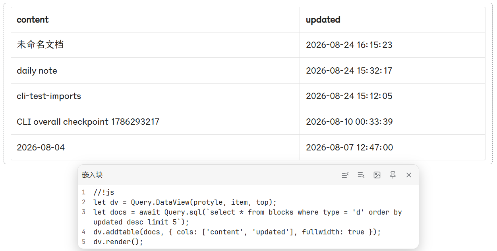
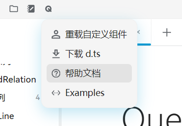
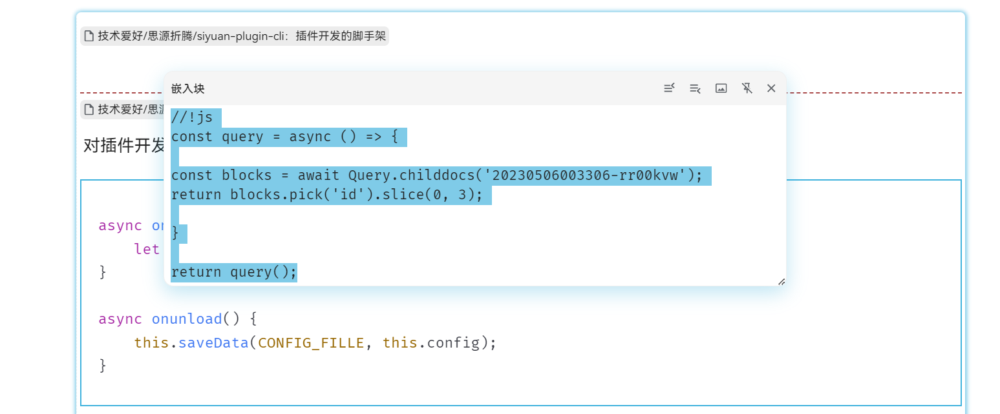
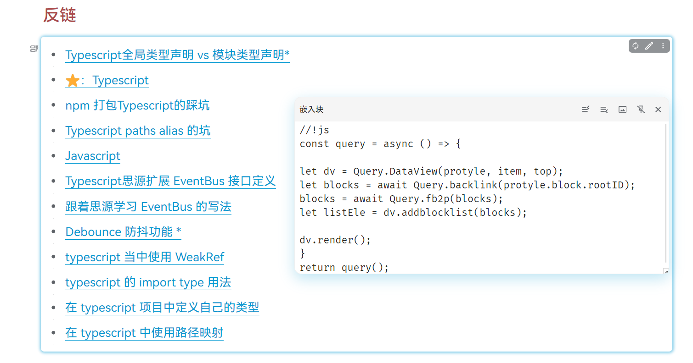
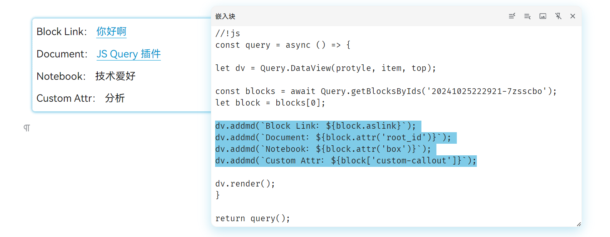
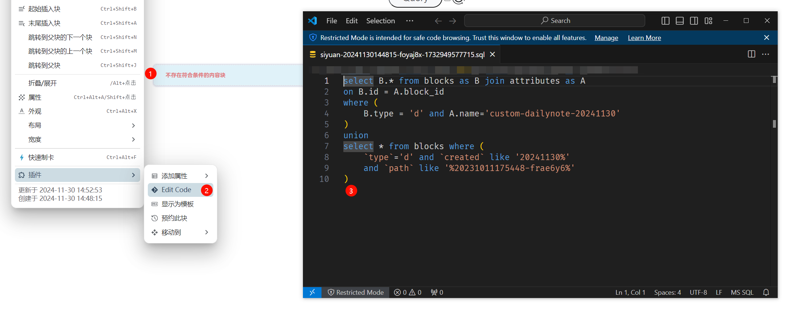

思源的嵌入块功能，支持使用 Javascript 语法进行查询。本插件调整了 API 结构、增加了若干功能，让在思源中使用 JS 查询变得更加简单方便，并优化了 DataView 接口，支持更加丰富、自定义化更强的数据展示功能。

## 最小示例

把下面的代码放进一个嵌入块，就能在文档中渲染出一个「最近更新的文档」表格：

```js
//!js
let dv = Query.DataView(protyle, item, top);
let docs = await Query.sql(`select * from blocks where type = 'd' order by updated desc limit 5`);
dv.addtable(docs, { cols: ['content', 'updated'], fullwidth: true });
dv.render();
```



> 💡 上面的代码只是一个最小演示；完整的基础模板与逐步说明见「从模板开始」，更多可复制的效果见「案例总览」。

⚠️ 注意，本文档默认读者了解基础的 Javascript 语法概念（至少需要理解基础的变量、流程控制、函数调用、async/await）。

> 🔀 **[更新日志](CHANGELOG.md)**

> 🔔 **完整的帮助文档，以插件内置的文档站为准。**
>
> 本插件随每个版本发布一个插件内文档站：安装插件后，点击顶栏插件菜单中的「帮助」，即可在思源内打开文档站。文档站的内容与当前安装的插件版本一致，可离线浏览，并且**不会在你的知识库中创建或更新任何笔记**；旧版本遗留的帮助笔记会保留原状，不再由插件更新。
>
> 
>
> 如果无法打开插件内文档站，也可以通过下方链接直接浏览本仓库 `docs/` 目录中的同一份内容。

## 功能速览

💡 插件提供丰富的查询、展示功能（这里提供一个概览印象，详细用法见文档站对应页面）。

1️⃣ 使用 Query API 进行嵌入块/SQL 查询。

案例：查询指定 ID 的文档的子文档，并只展示前三个文档：



2️⃣ 使用 DataView 对象，自定义地渲染嵌入块内容。

案例：查询当前文档的反向链接，并在嵌入块中渲染为块链接的列表：



3️⃣ 简化对查询结果的处理、访问。

使用 Query API 查询到的结果，在普通块属性的基础之上，会附带一些方便的属性与方法。例如可以直接使用 `aslink` 获取一个块的思源链接等：



4️⃣ 在外部代码编辑器中编辑嵌入块的代码，并随着外部编辑自动更新。



> 🖋️ **从示例开始学习**
>
> 学习本插件最好的方式，是从一些案例出发，快速了解插件的基本用法。安装插件后，在文档站的「案例」页即可查看、复制并改造这些案例；也可以直接浏览仓库中的[案例总览](docs/zh_CN/examples/index.md)。

## 内置使用文档

完整的说明文档分为「快速开始、主题、案例、Agent Reference」等部分，提供中英双语。以下页面即为插件内文档站的源内容（文档站直接渲染这些页面），可在 GitHub 上直接浏览：

**快速开始**

- [基本概念：什么是 JS 嵌入块](docs/zh_CN/quickstart/concepts.md) —— 嵌入块、执行环境，以及 `protyle`/`item`/`top` 变量。
- [从模板开始](docs/zh_CN/quickstart/template.md) —— 复制模板、插入嵌入块、运行并改造，快速跑起第一个 Query View。

**主题**

- [Query 查询](docs/zh_CN/topics/query.md) —— Query API、SQL 查询、WrappedList/WrappedBlock、Query.Utils、fb2p、pruneBlocks。
- [DataView 视图](docs/zh_CN/topics/dataview.md) —— list/table/md 及全部视图组件。
- [DataView 高级特性](docs/zh_CN/topics/dataview-advanced.md) —— 自定义视图组件、useState、生命周期与只读建议。
- [外部编辑器与调试](docs/zh_CN/topics/editor-tips.md) —— 外部编辑器、调试方法、配合思源模板。

**案例**

- [案例总览](docs/zh_CN/examples/index.md) —— 按用途/标签检索案例，复制并改造。

**Agent Reference**

Agent Reference 为自动生成的新版分级参考（当前仅提供英文，中文用户在文档站内会自动回退到英文版）：

- [Query API](docs/en_US/agent-ref/query-api.md) —— Query 各成员：SQL 与封装查询、工具函数、`DataView` 构造。
- [DataView](docs/en_US/agent-ref/dataview.md) —— 各个 DataView 组件及选项。
- [Wrapped Lists](docs/en_US/agent-ref/wrapped.md) —— `IWrappedList` / `IWrappedBlock` 的处理方法与元素形态。
- [Types](docs/en_US/agent-ref/types.md) —— 共用的选项与数据类型。

也可以在文档站首页打开或下载当前版本的 `types.d.ts` 类型声明。

**智能体技能**

- [智能体技能](skills/sy-query-view/SKILL.md) —— 随插件发布的 Agent Skill，为 AI 代理提供使用与查证 Query&View 的规则和参考。

## 技术细节说明

### `return` 返回什么

如果你不使用 `DataView` 构建可视化组件，那么 `return` 应当返回一个 Block ID 列表（`BlockID[]`）。此时，嵌入块本质上作为“高级版 SQL”的替代品，不会影响思源原生的嵌入块渲染逻辑。

如果你使用 `DataView`，则不要返回实质性对象。


### 新旧两版写法

如果您是 QueryView 的老用户，您可能记得旧版的通用写法形如:

```js
//!js
const query = async () => {
  let dv = Query.Dataview(protyle, item, top);
  let blocks = await Query.backlink(protyle.block.rootID);
  blocks = await Query.fb2p(blocks);
  dv.addList(blocks, { type: 'o', columns: 2 });
  dv.render();
}
return query();
```

其中 `const query = async () => ...` 必不可少——因为在旧版 SiYuan 中，JS 嵌入查询块内不允许在顶层使用 await 语句，必须将其封装在一个异步函数中。

3.8.0 版本更新后，这一限制已成为历史（但旧写法仍然可用）。新版本推荐使用更简洁的写法：

```js
//!js
let dv = Query.Dataview(protyle, item, top);
let blocks = await Query.backlink(protyle.block.rootID);
blocks = await Query.fb2p(blocks);
dv.addList(blocks, { type: 'o', columns: 2 });
dv.render();
```

## 感谢

感谢 Zxhd 开发的[基础数据查询](https://github.com/zxhd863943427/siyuan-plugin-data-query)插件——它较早地为思源的 JS 查询能力提供了扩展。本插件正是在其基础上调整了 API 结构、增加了若干功能，深受启发。
