思源的嵌入块功能，支持使用 Javascript 语法进行查询。而此前由 Zxhd 开发的[基础数据查询](https://github.com/zxhd863943427/siyuan-plugin-data-query)插件，提升了 JS 查询的能力。本插件在其基础上，调整了 API 结构，增加了若干功能，让在思源中使用 JS 查询变得更加简单方便；并优化了 DataView 接口，支持更加丰富、自定义化更强的数据展示功能。

⚠️ 注意，本帮助文档默认用户了解基础的 Javascript 语法概念。（至少需要理解基础的变量、流程、函数调用、aysnc/await）。

> 🔔 本帮助文档较长，在安装页面查看可能较为不方便。
>
> 你可以在下载下来之后，点击左上角菜单按钮中的“帮助文档”按钮，插件会自动在思源内创建一个帮助文档。
>
> ​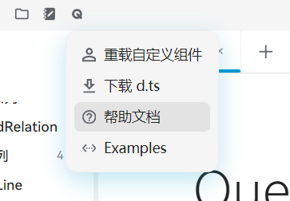​

## 0. 功能速览

💡 本插件大致可以提供以下功能（这里提供一个概览印象，详细用法见后面的说明）。

1️⃣ 使用 Query API 进行嵌入块/SQL 查询。

案例：查询指定 ID 的文档的子文档，并只展示前三个文档：

​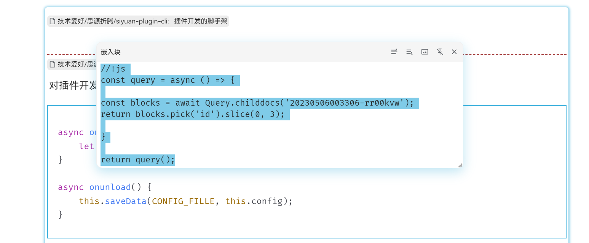​

2️⃣ 使用 DataView 对象，自定义地渲染嵌入块内容。

案例：查询当前文档的反向链接，并在嵌入块中渲染为块链接的列表。

​​

案例：使用 JS 创建的动态文档内容

​​

以及更多丰富的可渲染组件。

​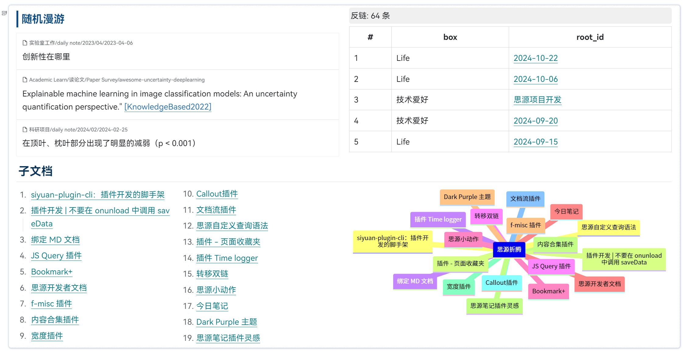​

3️⃣ 简化对查询结果的处理、访问。

使用 Query API 查询到的结果，在普通的块属性的基础上有一些别的方便的属性。比如在下面这个例子中，我们可以直接使用 `aslink`​ 获取一个块的思源链接等。

​​

4️⃣ 在外部代码编辑器中编辑嵌入块的代码，并随着外部的编辑自动更新源代码。

​​

## 1. 基本概念：什么是 JS 嵌入块

思源默认的嵌入块使用 SQL 语法，查询到 block 之后，会自动放入嵌入块渲染成为内容。

```sql
select * from blocks order by random() limit 1;
```

JS 嵌入块则是另一种特殊的用法，当嵌入块里面的内容以 `//!js`​ 为开头的时候，思源会将后面的代码内容视为 javascript 代码，并自动执行。

一个 JS 嵌入块的代码，会传入以下的变量：

* Protyle：嵌入块所在的文档的 protyle 对象
* item：嵌入块自身的 HTML 元素对象
* top：一个特殊的标识符，一般可以无视

而一个 JS 嵌入块的代码，理论上需要 **return 一个 Block ID 的列表**（`BlockID[]`​），这些 ID 对应的块就会被渲染到嵌入块中。

你可以尝试将如下的代码复制到嵌入块中，它会渲染当前嵌入块所在的文档。

```js
//!js
return [protyle.block.rootID]
```

💡 本插件提供了一系列功能，来增强 JS 嵌入块的功能。插件的核心是在嵌入块当中透传一个 `Query`​ API，大致关系如下。

```mermaid
flowchart TD
  Query
  DataView
  Query --> Query.Utils
  Query --> DataViews
  
  subgraph Queries
    Query --> sql
    Query --> backlink
    Query --> childdoc
    Query --> random
    Query --> A[...]
  end
  
  subgraph DataViews
    DataView --> List
    DataView --> Table
    DataView --> Markdown
    DataView --> Mermaid/Echarts
    DataView --> B[...]
  end

  CustomView -->|Register| DataViews
```

完整的接口文件请查看：[https://github.com/frostime/sy-query-view/blob/main/public/types.d.ts](https://github.com/frostime/sy-query-view/blob/main/public/types.d.ts)

## 2. 基础用法

### 使用 Query 进行 SQL 查询

使用本插件一个最简单的查询如下。其中：

* ​`Query`​ 对象是插件对外透传的一个 API 对象
* ​`Query.backlink`​ 表示查询某个文档的反向链接
* ​`protyle.block.rootID`​ 是当前嵌入块所在文档的 ID
* ​`blocks`​ 是查询到的块组成的列表（`Block[]`​)
* ​`block.pick('id')`​ 代表提取（pick）每个块的 `id`​ 属性，组成一个新的列表，再返回给思源

所以这段代码的功能就是：<u>查询当前所在文档的所有反链</u>。

```js
//!js
const query = async () => {
  let blocks = await Query.backlink(protyle.block.rootID);
  return block.pick('id'); //特殊工具函数，后面会介绍; 等价于blocks.map(b => b.id);
}
return query();
```

> 注：由于这个代码中用到了 async/await 语句，所以必须要把 await 相关的代码包裹在一个 async 函数里面，而不能直接放到外面。

不难看出，由于在代码中可以通过 `protyle.block.rootID`​ 自动获取到所在文档的 ID，也就免去了每次编写嵌入块的时候需要手动修改 `root_id`​ 字段的麻烦了，所以完全可以做到编写一次，到处运行——这也是 JS 查询的一个小优点。

​`Query.backlink`​ 本质上只是对思源的 SQL 查询进行了一些封装（如果你对思源的 SQL 查询不了解，请阅读[https://ld246.com/article/1683355095671](https://ld246.com/article/1683355095671)）。类似的函数有以下这些。

```ts
/**
 * 执行 SQL 查询
 * @returns Query results
 */
sql: (fmt: string) => Promise<any[]>;
/**
 * 查询指定块 ID 的所有反向连接
 * @returns Array of blocks linking to the specified block
 */
backlink: (id: BlockId, limit?: number) => Promise<Block[]>;
/**
 * 查询所有具有某种属性的块
 * @returns Array of matching blocks
 */
attr: (name: string, val?: string, valMatch?: "=" | "like", limit?: number) => Promise<Block[]>;
/**
 * Find unsolved task blocks
 * @param limit - Maximum number of results
 * @returns Array of unsolved task blocks
 */
task: (limit?: number) => Promise<any[]>;
/**
 * Randomly roam blocks
 * @param limit - Maximum number of results
 * @param type - Block type
 * @returns Array of randomly roamed blocks
 */
random: (limit?: number, type?: BlockType) => Promise<any[]>;
/**
 * Gets the daily notes document
 * @param limit - Maximum number of results
 * @param notebook - Notebook ID, if not specified, all daily notes documents will be returned
 * @returns Array of daily notes document blocks
 */
dailynote: (limit?: number, notebook?: NotebookId) => Promise<any[]>;
/**
 * Gets child documents of a block
 * @param b - Parent block or block ID
 * @returns Array of child document blocks
 */
childdoc: (b: BlockId | Block) => Promise<IWrappedList<IWrappedBlock>>;
/**
 * Gets blocks by their IDs
 * @param ids - Block IDs to retrieve
 * @returns Array of wrapped blocks
 */
getBlocksByIds: (...ids: BlockId[]) => Promise<IWrappedBlock[]>;
```

这些函数都可通过 `Query`​ 直接访问，最通用的自然是 `Query.sql`​，只要直接将 SQL 查询语句传入进去即可。

> 🔔 **注意**：以上的几个函数不一定包含全部的查询 API，想要查看完整的接口，请访问 [https://github.com/frostime/sy-query-view/blob/main/public/types.d.ts](https://github.com/frostime/sy-query-view/blob/main/public/types.d.ts)。

### DataView 的基础使用

以上的操作虽然使用了 javascript，但是在本质上似乎和原生的嵌入块没什么不同——最后查询到的结果依然是交给思源去渲染。但是如果使用 DataView 功能，则可以将查询到的块渲染为各种不同的视图。

在这一小节中，我们首先介绍三个最基础的视图组件：

1. 列表
2. 表格
3. markdown 文本

🔔 这些组件的高级用法，以及更多更复杂的组件，在后面的「进阶用法」中介绍。

#### DataView.list

首先给出一个基本的案例，相较于上面的 JS 查询，这里做了三个变动：1）在开头声明一个 DataView 对象；2）在查询到 `blocks`​ 后，使用 `dv.addlist`​ API；3）在最后去掉 `return`​，改为 `dv.render()`​

```js
//!js
const query = async () => {
  let dv = Query.DataView(protyle, item, top); //1. 在开头加上这么一行，注意 protyle, item, top 三个参数是永远固定不动的
  let blocks = await Query.random(5);
  dv.addlist(blocks); //2. 调用 dv.addlist 添加一个列表视图
  dv.render(); //3. 去掉 return, 以 dv.render() 结尾
}
return query();
```

通过以上的代码，我们就可以将 SQL 语句查询到几个块，以列表的形式在嵌入块中展示，效果如下：

​​

默认情况下，每个列表项都是一个块链接，同样可以悬浮查看以及点击跳转。

​​

在 list 函数的第二个参数中，可以传入一些可选项

```ts
{
    type?: 'u' | 'o'; //u 代表无序列表，o 代表有序列表；默认 u
    columns?: number; //传输一个整数后，会分栏显示
    renderer?: (b: T) => string | number | undefined | null; //渲染函数, 返回的值会被视为 markdown 文本
}
```

比如下面我们把列表以双列、有序列表的形式重新展示一遍；并且我们提供一个 renderer 函数，只展示这个块的 `hpath`​ 属性

```js
//!js
const query = async () => {
  let dv = Query.DataView(protyle, item, top);
  const blocks = await Query.random(5);
  dv.addlist(blocks, {
    type: 'o',
    columns: 2,
    renderer: (b) => b.hpath
  });
  dv.render();
}
return query();
```

​​

#### DataView.Table

除了列表之外，另一个最常用的视图应该就是表格了。我们把上面的代码重复一遍，不过这次换成 `addtable`​

```js
//!js
const query = async () => {
  let dv = Query.DataView(protyle, item, top); //永远是这个开头不动
  const blocks = await Query.random(5);
  dv.addtable(blocks);
  dv.render(); //永远是这个结尾不动
}
return query();
```

效果如下：

​​

table 组件会自动以合适的方式渲染不同的列：比如 type 被渲染为实际的类型名称、hpath 被渲染为文档的超链接、box 被渲染为实际的笔记本的名称等。

表格默认显示的列，可以在设置中配置。

​​

同样，表格也有一些可以配置的字段。

```ts
{
    center?: boolean; //居中
    fullwidth?: boolean; //全宽
    index?: boolean;  //显示行号
    cols?: (string | Record<string, string>)[] | Record<string, string>;
    renderer?: (b: Block, attr: keyof Block) => string | number | undefined | null;
}
```

前面三个属性的用法比较直观，主要是制定了表格的显示方式。

​​

更重要的是 `cols`​ 这个属性——他可以绕过默认的配置，自行指定需要展示的列，不考虑复杂的用法，可以只用记住两种最简单的用法：

* 为 `null`​，则显示所有的列
* 为块属性名称的列表，则显示对应的列

```js
//!js
const query = async () => {
  let dv = Query.DataView(protyle, item, top);
  const blocks = await Query.backlink(dv.root_id);  //dv.root_id 等价于 protyle.block.rootID，算是能少写一点字
  dv.addtable(blocks, { fullwidth: false, cols: null}); //全部显示
  dv.addtable(blocks, { fullwidth: true, cols: ['root_id', 'box', 'updated']});
  dv.render();
}
return query();
```

​​

> 上面第一个表格，由于太宽了，所以把 `fullwidth`​ 关掉，这样就可以横向滚动查看了。

renderer 函数用于指定渲染各个列（key）的方案，如果不指定则使用默认的单元格渲染方案。而如果返回值为 null ，同样会会退到默认方案。

对比以下的案例，很明显就能看出区别，一个全部使用默认方案，另一个自定义了 id 和 box 两列的渲染方案。

```js
//!js
const query = async () => {
  let dv = Query.DataView(protyle, item, top);
  const blocks = await Query.random(3);
  dv.addtable(blocks, { 
    cols: ['id', 'hpath', 'root_id', 'box']
  });
  dv.addtable(blocks, { 
    cols: ['id', 'hpath', 'root_id', 'box'],
    renderer: (block, key) => {
        if (key == 'id') return block[key]; // key 列直接显示原始文本
        if (key == 'box') return 'Hahaha';
    }
  });
  dv.render();
}
return query();
```

​​

#### DataView.md

不知道你有没有注意，在上面展示表格的几个参数的时候，在截图中有一些标注文字。这些文字，实际上是 markdown 组件。我们可以通过 `dv.md`​ 的形式，构造一个 markdown 视图。

```js
//!js
//这里由于没有 await 的需要，所以可以把外层的 async 函数去掉
let dv = Query.DataView(protyle, item, top);
dv.addmd('## 这是一个二级标题')
dv.addmd(`当前文档的 id 是: ${protyle.block.rootID}`)
dv.addmd(`
1. 第一个
2. 第二个

{{{col
支持思源自己的多栏布局语法

这是第二列
}}}

> 截图中双栏的外边框是我思源的代码片段，但是这个块的样式则是思源自带的 ial 语法
{: style="background-color: var(--b3-theme-primary-light); font-size: 20px;"}

`)
dv.render();
```

​​

> ⚠️ 不过遗憾的是，markdown 组件并不支持数据公式等这些需要额外渲染的内容。

尽管有一些限制，markdown 组件配合 javascript 的[模板字符串](https://developer.mozilla.org/zh-CN/docs/Web/JavaScript/Reference/Template_literals)还是能有相当大的作用的，也能有效地充实 DataView 的内容。下面给一个小例子，通过 `fetch`​ 获取网络上的资源，然后在嵌入块中显示每日一句。

⚠️ 注意，由于使用了（网上随便找到）网络接口，所以你在本地测试的时候不一定能获取到数据。

```js
//!js
let dv = Query.DataView(protyle, item, top);
fetch('https://api.xygeng.cn/one').then(async ans => {
 console.log(ans)
 if (ans.ok) {
    let data = await ans.json();
    console.log(data)
    dv.addmd('今天的每日一句')
    dv.addmd(`> ${data.data.content} —— ${data.data.origin}`)
 }
})
dv.render();
```

​​

## 3. 进阶用法 - Query 查询

> 💡 **注意**：不同于主要面向普通的用户的基础用法，后续的进阶用法将默认用户拥有基本的 javascript/typescript 阅读和编码能力

以下介绍一些 Query 查询的高级用法。

🔔 在进阶介绍前，首先需要说明两点：

1. Query 中的方法为无状态的函数（当然，Query 方法返回的对象就不一定了，例如 DataView 就是有状态的）
2. Query 下的方法都有一些别名，其中至少包括原方法的全小写格式。

    例如你可以调用 `Query.utils.asmap`​ ，等价于 `Query.Utils.asMap`​。

### WrappedList & WrappedBlock

尽管在基础用法章节里，我们简单介绍了使用 `Query`​ 进行 SQL 查询的便利性，但是最大的优点却没有提到——所有使用 Query API 查询得到的结果都**额外附加了一些便利的工具方法或者属性**。

使用 Query 查询得到的结果在理念上被视为一个表结构，每一个元素代表了个思源的 Block。

```ts
[ 
  {'id': 'ID-111', 'type': 'd', created: '20230401001000'},
  {'id': 'ID-hhh', 'type': 'd', created: '...'},
  {'id': 'ID-kkk', 'type': 'b', created: '...'},
]
```

​​

为了方便对这个表数据进行操作：

* 表查询列表中的每个元素，会被封装成一个 `IWrappedBlock`​ 对象，提供关于块元素的常用操作
* 表查询列表自身，会被封装成一个 `IWrappedList`​ 对象，以便于快速完成一些对「表数据结构」的操作

#### IWrappedBlock

所有 `Query`​ API 查询返回的列表里面的对象，都会被封装成一个 `IWrappedBlock`​，你可以把他理解为一个普通的 `Block`​ 对象，但是又额外多了一些属性和方法：

```ts
// 不一定完整，完整 API 文档以 repo/public/types.d.ts 为准
interface IWrappedBlock extends Block {
    /** Method to return the original Block object */
    unwrap(): Block;
    /** Original Block object */
    unwrapped: Block;
    /** Block's URI link in format: siyuan://blocks/xxx */
    asurl: string;

    /** Block's Markdown format link */
    aslink: string;

    /** Block's SiYuan reference format text */
    asref: string;

    /**
     * Returns a rendered SiYuan attribute
     * @param attr - Attribute name
     * @param renderer - Custom render function, uses default rendering when returns null
     */
    attr(attr: keyof Block, renderer?: (block: Block, attr: keyof Block) => string | null): string;

    /** Update date in YYYY-MM-DD format */
    updatedDate: string;
    /** Creation date in YYYY-MM-DD format */
    createdDate: string;
    /** Update time in HH:mm:ss format */
    updatedTime: string;
    /** Creation time in HH:mm:ss format */
    createdTime: string;
    /** Update datetime in YYYY-MM-DD HH:mm:ss format */
    updatedDatetime: string;
    /** Creation datetime in YYYY-MM-DD HH:mm:ss format */
    createdDatetime: string;
    /** Get custom attribute value */
    [key: `custom-${string}`]: string;
}
```

以上所有的属性可以分为几组来理解：

1. 渲染为链接或者引用，也就是 `aslink`​, `asref`​ 这些（不过实际上由于渲染成为引用并不会真的在 ref 表中创建关联关系，所以大部分时候使用 link 就可以了，ref 的意义不大）
2. 时间戳相关：额外为 updated，created 这些拓展了一些属性，方便直接用来展示块的时间戳
3. ​`attr`​ 函数：

    * 传入块和块的属性，返回一个属性渲染后的 markdown 文本（就像我们前面在 table 小节提到的那样）
    * 你也可以自己传入一个自定义的 renderer，然后返回一段 markdown 文本，如果没有返回或者返回 null，则回退到默认的渲染方案
4. ​`custom-xxx`​ 属性，可以直接访问块的自定义属性，例如 `block['custom-b']`​，会访问对应块的 `custom-b`​ 属性。

​​

> 🔔 以上介绍不一定完整，完整 API 文档以 `repo/public/types.d.ts`​ 为准

#### IWrappedList

所有 `Query`​ API 查询返回的结果列表，都是一个 `IWrappedList`​ 对象，你可以把他理解为一个普通的 `Array<T>`​，但是又额外多了一些方法。

🔔 IWrappedList 也是无状态的，所有的 API 均会返回一个更改后的副本，而非做原地修改。

```ts
// 不一定完整，完整 API 文档以 repo/public/types.d.ts 为准
export interface IWrappedList<T> extends Array<T> {
    /** Method to return the original array */
    unwrap(): T[];

    /** Original array */
    unwrapped: T[];

    /**
     * Returns a new array containing only specified properties
     * @param attrs - Property names to keep
     */
    pick(...attrs: (keyof T)[]): IWrappedList<Partial<T>>;

    /**
     * Returns a new array excluding specified properties
     * @param attrs - Property names to exclude
     */
    omit(...attrs: (keyof T)[]): IWrappedList<T>;

    /**
     * Returns a new array sorted by specified property
     * @param attr - Property to sort by
     * @param order - Sort direction, defaults to 'asc'
     */
    sorton(attr: keyof T, order?: 'asc' | 'desc'): IWrappedList<T>;

    /**
     * Returns an object grouped by specified condition
     * @param predicate - Grouping criteria, can be property name or function
     * @param fnEach - Optional callback function for each group
     */
    groupby(
        predicate: keyof T | ((item: T) => any),
        fnEach?: (groupName: any, list: T[]) => unknown
    ): Record<string, IWrappedList<T>>;

    /**
     * Returns a filtered new array, ensuring it's also an IWrappedList
     * @param predicate - Filter condition function
     */
    filter(predicate: (value: T, index: number, array: T[]) => boolean): IWrappedList<T>;
    /**
     * Returns a new array containing elements in the specified range
     * @param start - Start index
     * @param end - End index
     */
    slice(start: number, end: number): IWrappedList<T>;
    /**
     * Returns a new array with unique elements
     * @param {keyof Block | Function} key - Unique criteria, can be property name or function
     * @example
     * list.unique('id')
     * list.unique(b => b.updated.slice(0, 4))
     */
    unique(key?: keyof T | ((b: T) => string | number)): IWrappedList<T>;
    /**
     * Returns a new array with added rows
     * @alias addrows
     * @alias concat: modify the default method of Array
     */
    addrow(newItems: T[]): IWrappedList<T>;

    /**
     * Returns a new array with added columns
     * @param {Record<string, ScalarValue | ScalarValue[]> | Record<string, ScalarValue>[] | Function} newItems - New columns to add
     * @alias addcols
     * @alias stack
     * @example
     * list.addcol({ col1: 1, col2: 2 }) // Add two columns, each with repeated elements
     * list.addcol({ col1: [1, 2], col2: [4, 5] }) // Add two columns
     * list.addcol([{ col1: 1, col2: 2 }, { col1: 3, col2: 4 }]) // Add two columns, each item in list corresponds to a row
     * list.addcol((b, i) => ({ col1: i, col2: i * i })) // Add two columns, each with elements generated based on index
     */
    addcol(newItems: Record<string, ScalarValue | ScalarValue[]> |
        Record<string, ScalarValue>[] |
        ((b: T, index: number) => Record<string, ScalarValue> | Record<string, ScalarValue[]>)): IWrappedList<T>;

}
```

IWrappedList 中多出来的方法，可以分这几个大类理解：

* ​`unwrapped`​/`unwrap()`​：用于返回原始的列表对象
* 重写 Array 的一些常用的用于“返回的新的列表”的方法，保证返回值依然是一个 `IWrappedList`​

  * ​`filter`​
  * ​`slice`​
  * ​`map`​
* 在查询代码中常见的一些功能函数

  * ​`pick`​：对保留列表中每个块特定的字段，例如 `blocks.pick('id')`​ 会返回一个块 ID 的列表，`blocks.pick('id', 'content')`​ 会返回一个 `{id: string, content: strint}[]`​ 类型的列表；对应到表结构操作上，等于是只保留特定的数据列
  * ​`omit`​：同上，但是传入的 key 名称会被抛弃而非保留；对应到表结构操作上，等于是丢弃特定的数据列
  * ​`sorton`​：指定用于排序的 key 名称，返回排序之后的列表
  * ​`groupby`​：对列表进行分组操作，有两个参数：

    * 第一个参数 `predicate`​

      * 可以是 Block 的键名称，例如 `blocks.groupby('box')`​ 就是按照笔记本 ID（`box`​）分组
      * 也可以是一个返回标量数据的函数，例如 `blocks.groupby(b => b.created.slice(0, 4))`​
    * 第二个参数 `forEach`​ 可以用来迭代分组之后的结果，参数为 `groupName`​ 和 `groupedBlocks`​
  * ​`unique`​：对列表进行去重操作，传入的参数可以是

    * Block 的键名称，例如 `blocks.unique('root_id')`​ 意味着每个文档（`root_id`​）只保留一个块
    * 一个返回标量数据的函数，用作去重的比较值
  * ​`addrow`​：实际上就是 `Arrray.concat`​ 函数，传入一个外部的列表，合并成一个新的 `WrappedList`​
  * ​`addcol`​：传入外部的数据，外表结构添加特定的列，例如：

    * ​`list.addcol({ col1: 1, col2: 2 })`​
    * ​`list.addcol({ col1: [1, 2], col2: [4, 5] })`​
    * ​`list.addcol([{ col1: 1, col2: 2 }, { col1: 3, col2: 4 }])`​
    * ​`list.addcol((b, i) => ({ col1: i, col2: i * i }))`​
  * ​`asmap`​：本质上就是调用 reduce，将列表转换成 `Record<keyof Block, Block>`​

    * 例如 `list.asmap()`​，默认会返回 `Record<Block['id'], Block>`​ 的结构

> 🔔 以上介绍不一定完整，完整 API 文档以 repo/public/types.d.ts 为准

### Query.Utils

Query.Utils 内包含了一些可能会比较有用的工具函数。

#### 时间相关工具函数

utils 下最有用的可能就是时间相关的函数了，其中的重中之重是这个 API

```ts
Query.Utils.Date: (value?: any) => SiYuanDate;
```

调用 Date 将返回一个 SiYuanDate 对象，他本质上是一个 javascript 的 Date 类，但是针对思源做了专门的设计：

```ts
declare class SiYuanDate extends Date {
    //返回当天零点时刻的时间
    beginOfDay(): SiYuanDate;
    //格式化为 yyyyMMddHHmmss
    toString(hms?: boolean): string;
    [Symbol.toPrimitive](hint: string): any;
    static fromString(timestr: string): SiYuanDate;
    //计算天数, days 可以是number （表示天数）, 也可以是字符串
    //如 '1d' 表示 1 天，'2w' 表示 2 周，'3m' 表示 3 个月，'4y' 表示 4 年
    add(days: number | string): SiYuanDate;
}
```

SiYuanDate 在格式化为字符串的时候，会转换成和 `created`​ `updated`​ 同样格式的字符串；并且还可以使用 `add`​ 方法进行日期的计算。

你可以使用两种方式格式化为字符串，一种是直接字符串插值 `${date}`​，另一种是调用 `toString()`​ 方法。其中后者有一个 `hms`​ 参数，如果设置为 false 将只输出日期部分而去掉时分秒部分。

```js
//!js
let dv = Query.DataView(protyle, item, top);
let date = Query.Utils.Date(); //now
dv.addmd(`
Now ${date}
Start of this day: ${date.beginOfDay()}
10 days later: ${date.beginOfDay().add(10)}
1 weeks later: ${date.beginOfDay().add('1w')}
1 month ago: ${date.add('-1m')}

\`\`\`sql
select * from blocks where created like '${date.add(-7).toString(false)}%'
\`\`\`

`);
dv.render();
```

​​

当然如果你懒得每次都要实例化一个 Date 对象，那么 utils 下还有一些快捷函数。

```ts
declare interface Partial<Query['Utils']> {
    /**
     * Gets timestamp for current time with optional day offset
     * @param days - Number or string of days to offset (positive or negative)
     * @returns Timestamp string in yyyyMMddHHmmss format
     */
    now: (days?: number | string, hms?: boolean) => string;
    /**
     * Gets the timestamp for the start of today
     * @param {boolean} hms - Whether to include time, e.g today(false) returns 20241201, today(true) returns 20241201000000
     * @returns Timestamp string in yyyyMMddHHmmss format
     */
    today: (hms?: boolean) => string;
    /**
     * Gets the timestamp for the start of current week
     * @param {boolean} hms - Whether to include time, e.g thisWeek(false) returns 20241201, thisWeek(true) returns 20241201000000
     * @returns Timestamp string in yyyyMMddHHmmss format
     */
    thisWeek: (hms?: boolean) => string;
    /**
     * Gets the timestamp for the start of current month
     * @returns Timestamp string in yyyyMMddHHmmss format
     */
    thisMonth: (hms?: boolean) => string;
    /**
     * Gets the timestamp for the start of current year
     * @returns Timestamp string in yyyyMMddHHmmss format
     */
    thisYear: (hms?: boolean) => string;
    /**
     * Converts SiYuan timestamp string to Date object
     * @param timestr - SiYuan timestamp (yyyyMMddHHmmss)
     * @returns Date object
     */
    asDate: (timestr: string) => SiYuanDate;
    /**
     * Converts Date object to SiYuan timestamp format
     * @param date - Date to convert
     * @returns Timestamp string in yyyyMMddHHmmss format
     */
    asTimestr: (date: Date) => string;
}
```

使用这些函数，可以快速地在 sql 语句中插入你想要的时间成分。

```js
//!js
const query = async () => {
  const sql = `select * from blocks
  where updated >= '${Query.Utils.thisWeek()}'
  limit 5
  `;
  const blocks = await Query.sql(sql);
  return blocks.map(b => b.id);
}
return query();
```

#### 其他工具函数

其他可以说的工具函数不多，实用性可能也没那么大了。

```ts
declare interface Partial<Query['Utils'] > {
    asMap: (blocks: Block[], key?: string) => {
        [key: string]: Block;
        [key: number]: Block;
    };

    notebook: (input: Block | NotebookId) => Notebook;
    boxName: (boxid: NotebookId) => string;
    typeName: (type: BlockType) => any;
    renderAttr: (b: Block, attr: keyof Block, options?: {
        onlyDate?: boolean;
        onlyTime?: boolean;
    }) => string;

    asLink: (b: Block) => string;
    asRef: (b: Block) => string;

    openBlock: (id: BlockId) => void;
}
```

* ​`notebook`​ 和 `boxName`​ 主要用于获取笔记本的名称，因为通过 sql 获取的 box 字段只是 notebook 的 id，而通过 `notebook`​ 可以获取完整的笔记本对象，而 `boxname`​ 则会返回笔记本的名称。

  * 🤔 我也不知道为啥思源里面笔记本会有“notebook”和“box”两种叫法，各位自适应吧
* ​`typeName`​ 输入一个思源 SQL 查询结果的 `type`​ 字段，会返回其可读的名称
* ​`renderAttr`​ 实际上就是 table 组件用的默认渲染函数
* ​`openBlock`​ 是个特别方法，传入块的 ID 可以在思源中打开对应的块
* ​`asMap`​ 等价于  `IWrappedList`​ 的 `asmap`​ 函数
* ​`asLink`​ 和 `asRef`​ 本质上等价于调用 `IWrappedBlock`​ 的这两个属性

### fb2p （容器块传递）

> 🖋️ 本函数有一个 `redirect`​ 的别名。

fb2p （或者说引用关系转移）的目的是处理容器块和段落块嵌套情况，他会将将容器块的第一个段落块 ID 重定向到容器块的 ID。

📣 首先我们解释一下这个 API 的使用背景。现在假定有一个列表块，引用了另外的一个块

​​

我们使用下面的 SQL 来查询被引用块的所有反链信息

```sql
select * from blocks where id in (
  select block_id from refs where def_block_id = '20241025224026-r416ywi'
) order by updated desc;
```

效果如下：

​​

令人意外的是，查询的结果只包含了引用的所在的段落，而不会像反链面板那样展示整个列表项块。

​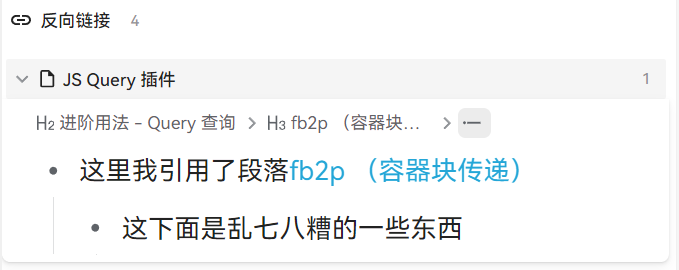​

这里的原因在于，列表项块是一个容器类型（如图中标号 2 的黄色范围），他本身是不自带内容的。所以实际在思源底层，真正引用了目标的块是列表块的第一个段落块（如图中标号 1 的红色范围）—— 而之所以在反链面板当中会显示完整的列表项，是因为思源在反链面板里会做特殊的处理。

​​

而这也就是 `fb2p`​ 起作用的时候了：它的理念是「**一个容器块的第一个子块如果是段落块，那么这个段落块应该能代表整个容器块**」。

所以，我们可以将一个 Block 列表传递给 `fb2p`​ ，他会完成重定向的功能，将 block 的 ID 修改为他的父容器块的 ID（first block to it's parent）。

```ts
fb2p(inputs: Block[], enable?: { heading?: boolean, doc?: boolean }) => Promise<Block[]>
```

```js
//!js
return (async () => {
  let blocks = await Query.backlink('20241025224026-r416ywi');
  blocks = await Query.fb2p(blocks);
  return blocks.map(b => b.id);
})()
```

二者效果对比如下：

​​

fb2p 支持传递列表项、引述块两种容器。同时也支持传递到标题和文档块中。

* **标题**：如果段落块为某个标题块下方第一个子块，则会传递到上方的标题中
* **文档**：如果段落块为文档下方第一个子块，则会传递到文档块中

特别是后者，能帮助实现文档基本的引用，下图是一个案例。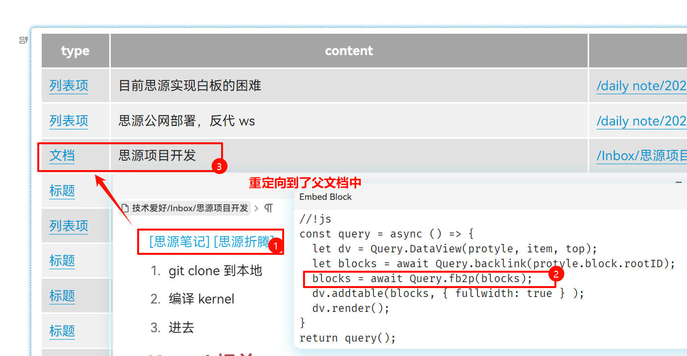​

✨ **特殊用法**：强制传递到文档。在 fb2p 中内置了一个规则：当所在的段落中存在一个名为 `#DOCREF#`​ 或者 `#文档引用#`​ 的 tag 的时候，该块会被强制重定向到文档块。

## 4. 进阶用法 - DataView 各种视图组件

### 视图组件的用法

在前面的小节当中，我们介绍了 `addlist`​, `addtable`​ 和 `addmd`​三种用法。这里面的 list, table, md 都是视图组件。

Dataview 中定义了若干的视图组件，例如如下是 markdown 组件的创建声明。

```ts
/**
 * Adds markdown content to the DataView
 * @param md - Markdown text to be rendered
 * @returns HTMLElement containing the rendered markdown
 * @example
 * dv.addmd(`# Hello`);
 */
markdown(md: string): HTMLElement;
```

每当一个新的 Dataview 创建的时候， markdown 组件就会注册到创建的 dataview 实例中、添加 `add`​ 方法：

1. 调用`dv.markdown`​ ：创建 Markdown 组件并**直接返回 HTML 元素，而不添加到视图中**
2. 调用 `dv.addmarkdown`​ ：创建 Markdown 组件并**自动加入到 DataView 的视图当中**

每个 `dv.xxx/dv.addxxx`​ 函数，都会返回对应视图元素的 container Element，这些 container 元素会：

* 有类似 `data-view-component`​ 的类名（由于 moudule css 的原因，可能实际不完全是这个名称）
* 有一个 `data-id`​ 属性唯一标识一个视图

  ```js
  const ele = dv.addmd('## hi')
  const mdId = ele.dataset.id;
  ```

​​

一些组件还会定义一些别名（Alias），例如 markdown 组件有一个 md 的别名。这意味着：

* ​`dv.md`​ 等价于 `dv.markdown`​
* ​`dv.addmd`​ 等价于 `dv.addmarkdown`​

> 🔔 注：`DataView`​ 会给所有的组件**自动添加他小写版本的别名。**

以下介绍 Dataview 中内置的一些其他的组件。

### 嵌套 list

在前面我们介绍过 list 的基本用法。不过有些复杂一些的用法还没有涉及到：list 组件可以显示嵌套列表。

如果传入 list 组件的某个元素中，如果含有 `children`​ 元素，那么将会以嵌套列表的形式渲染整个列表。

```ts
list(data: (IBlockWithChilds | ScalarValue)[], options?: IListOptions<Block>): HTMLElement;

interface IBlockWithChilds extends Block, IHasChildren<Block>, ITreeNode {
    id: string;
    name: string;
    content: string;
    children?: IBlockWithChilds[];
}
```

🖋️ 以下这个案例，会使用 list 组件来展示当前文档的二级子目录。

```js
//!js
const query = async () => {
    let dv = Query.DataView(protyle, item, top);
    let childs = await Query.childdoc(dv.root_id);
    for (let child of childs) {
        //获取子文档的子文档
        const subchilds = await Query.childdoc(child.root_id);
        child.children = subchilds;
    }
    dv.addlist(childs);
    dv.render();
}
return query();
```

​​

‍

### embed

```ts
 embed(blocks: Block[] | Block, options: {
      breadcrumb?: boolean;
      limit?: number;
      columns?: number;
      zoom?: number;
  }): HTMLElement;
```

Embed 组件用于显示块的内容（相当于在嵌入块里面塞入一个简版的嵌入块），传入的参数为块或者块的列表。

```js
//!js
const query = async () => {
    let dv = Query.DataView(protyle, item, top);
    let blocks = await Query.random(2);
    dv.addembed(blocks)
    dv.render();
}

return query();
```

​​

每个嵌入组件右上角有一个小图标，点击后可以跳转到对应的块中。此外嵌入组件还有几个额外的参数：

* breadcrumb：是否显示文档面包屑
* limit：限制显示的块的数量
* zoom：缩放因子, 0 ~ 1 之间，1 代表不缩放
* columns：多行显示

在希望嵌入块显示的内容比较紧凑的时候，这几个参数可能有用。如下展示了一个案例：限制只显示 3 个块，缩放到 0.75 比例，并且以双栏展示。

```js
//!js
const query = async () => {
    let dv = Query.DataView(protyle, item, top);
    let blocks = await Query.random(5, 'd');
    dv.addembed(blocks, {
      limit: 3, zoom: 0.75, columns: 2
    });
    dv.render();
}

return query();
```

​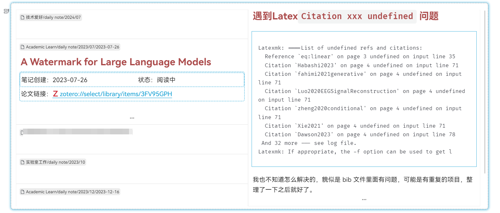​

### mermaid 系列

mermaid 组件可以传入一个 mermaid 的代码，然后在 DataView 中渲染展示。

```js
mermaid(code: string): HTMLElement;
```

例如一个最简单的案例如下。

```js
//!js
const dv = Query.DataView(protyle, item, top);
dv.addmermaid(`
graph LR
  A --> B
`);
dv.render();
```

​​

除了原始的 mermaid，DataView 还提供一些在 mermad 基础上的构建的视图。

#### mermaidRelation

```ts
mermaidRelation(tree: IBlockWithChilds | Record<string, Block[]>, options?: {
    type?: "flowchart" | "mindmap";
    flowchart?: 'TD' | 'LR';
    renderer?: (b: Block) => string;
}): HTMLElement;

interface IBlockWithChilds extends Block, IHasChildren<Block>, ITreeNode {
    id: string;
    name: string;
    content: string;
    children?: IBlockWithChilds[];
}
```

mermaidRelation 主要用于可视化块之间的关联关系。他传入的参数和嵌套 list 传入的参数类型——都是可以有 `children`​ 列表属性的块列表 `Block[]`​。

可以将 options.type 参数指定为 "flowchart" 或者 "mindmap" 两种类型，分别对应了两种不同的 mermaid 图表。

下面的案例展示了通过 flowchart 绘制当前块的两层文档树关系。

```js
//!js
const query = async () => {
    let dv = Query.DataView(protyle, item, top);
    let thisdoc = await Query.thisdoc(protyle);
    let childs = await Query.childdoc(dv.root_id);
    for (let child of childs) {
        //获取子文档的子文档
        const subchilds = await Query.childdoc(child.root_id);
        child.children = subchilds;
    }
    thisdoc.children = childs; //构建 tree 结构的根结点
    dv.addmermaidRelation(thisdoc, { type: 'flowchart', flowchart: 'LR' } );
    dv.render();
}

return query();
```

​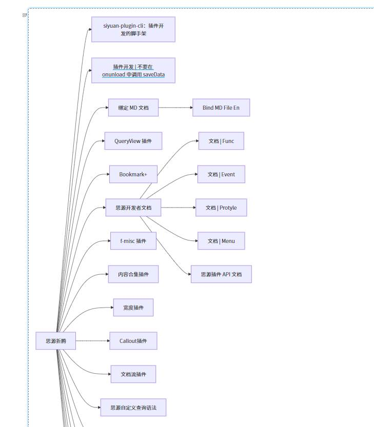​

把 `type: 'flowchart'`​ 换成 `mindmap`​ 也可以用思维导图的形式显示：

​​

😃 此外，relation 图中的节点，如果对应了一个思源的内容块，那么是可以**悬浮显示内容**以及**点击跳转**到对应文档的。

​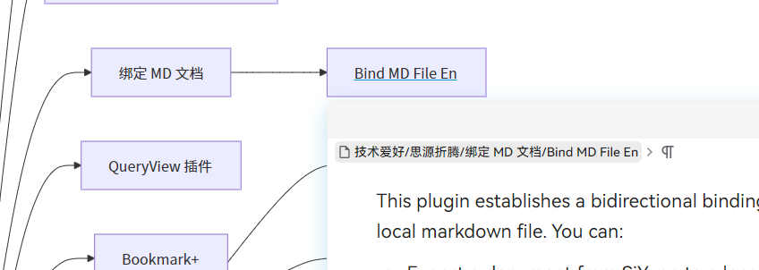​

​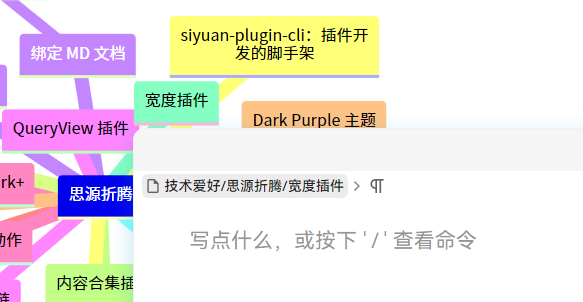​

​`mermaidRelation`​ 通过 `type`​ 参数指定对应的视图，为了方便使用，`dv`​ 提供了两个等价的组件：

* ​`dv.mflowchart`​：等价于 flowchart 的 Relation 图
* ​`dv.mmindmap`​：等价于 mindmap 的 Relation 图

### echarts 系列

```ts
echarts(echartOption: IEchartsOption, options?: {
    height?: string;
    width?: string;
    events?: {
        [eventName: string]: (params: any) => void;
    };
}): HTMLElement;
```

可以通过 `dv.echarts`​ 的方式，生成一个 echarts 图表，其中第一个参数为 echarts 的 `option`​ 参数。参考 [https://echarts.apache.org/zh/option.html](https://echarts.apache.org/zh/option.html)。

> ⭐ 关于 echarts，请参考：[https://echarts.apache.org/handbook/zh/get-started/](https://echarts.apache.org/handbook/zh/get-started/)
>
> 🖋️ 默认情况下，echarts 以 svg 的方式渲染，如果你想要换成 canvas，可以在插件的设置中更改。

```js
//!js
const option = {
  xAxis: {
    type: 'category',
    boundaryGap: false,
    data: ['Mon', 'Tue', 'Wed', 'Thu', 'Fri', 'Sat', 'Sun']
  },
  yAxis: {
    type: 'value'
  },
  series: [
    {
      data: [820, 932, 901, 934, 1290, 1330, 1320],
      type: 'line',
      areaStyle: {}
    }
  ]
};
let dv = Query.DataView(protyle, item, top);
dv.addecharts(option);
dv.render();
```

​​

height 和 width 两个参数决定了 echart 图容器的高度和宽度，默认高度为 300px，宽度为 100%。

#### echartsLine

```ts
echartsLine(x: number[], y: number[] | number[][], options?: {
    height?: string;
    width?: string;
    title?: string;
    xlabel?: string;
    ylabel?: string;
    legends?: string[];
    seriesOption?: IEchartsSeriesOption | IEchartsSeriesOption[];
    echartsOption?: IEchartsOption;
}): HTMLElement;
```

echarts line 主要用于绘制折线图。他有一个 `eLine`​ 的别名。你可以参考 [https://echarts.apache.org/examples/zh/editor.html?c=line-simple](https://echarts.apache.org/examples/zh/editor.html?c=line-simple) 来了解他的基本效果。

传入的数据参数：

* ​`x`​：曲线的 x 轴数据
* ​`y`​：曲线的 y 轴数据，可以传入多个，这样会显示多条曲线

​`options`​ 参数如下：

* ​`height`​/`width`​：同 echart 组件的参数
* ​`title`​：折线图的标题
* ​`xlabel`​, `ylabel`​：x 轴和 y 轴的标签
* ​`legends`​：曲线的名称
* ​`seriesOption`​：可传入自定义的 series option 覆盖内部默认值

  * 见：[https://echarts.apache.org/zh/option.html#series-line](https://echarts.apache.org/zh/option.html#series-line)
* ​`echartsOption`​：可传入自定义的 echart option 覆盖内部默认的值

  * 见：[https://echarts.apache.org/zh/option.html#title](https://echarts.apache.org/zh/option.html#title)

🖋️ **案例**：统计各个月份中创建文档数量的变化情况，并绘制为曲线

```js
//!js
const query = async () => {
    let dv = Query.DataView(protyle, item, top);
    const SQL = `
    SELECT
        SUBSTR(created, 1, 6) AS month,
        COUNT(*) AS count
    FROM
        blocks
    WHERE
        type = 'd'
    GROUP BY
        SUBSTR(created, 1, 6)
    ORDER BY
        month;
    `;

    let blocks = await Query.sql(SQL);

    dv.addeline(blocks.pick('month'), blocks.pick('count'), {
        title: '每月创建的文档数量',
        xlabel: '月份',
        ylabel: '创建文档数'
    });

    dv.render();
}

return query();
```

​​

#### echatsBar

```ts
echartsBar(x: string[], y: number[] | number[][], options?: {
    height?: string;
    width?: string;
    title?: string;
    xlabel?: string;
    ylabel?: string;
    legends?: string[];
    stack?: boolean;
    seriesOption?: IEchartsSeriesOption | IEchartsSeriesOption[];
    echartsOption?: IEchartsOption;
}): HTMLElement;
```

echarts line 主要用于绘制柱状图。他有一个 `eBar`​ 的别名。可参考：[https://echarts.apache.org/examples/zh/editor.html?c=bar-simple](https://echarts.apache.org/examples/zh/editor.html?c=bar-simple) 查看他的基本效果。

传入的数据参数：

* ​`x`​：柱状图的 x 轴数据
* ​`y`​：柱状图的 y 轴数据，可以传入多个，根据 `options.stack`​ 来决定是分开显示还是堆叠显示

​`options`​ 参数如下：

* ​`height`​/`width`​：同 echart 组件的参数
* ​`title`​：折线图的标题
* ​`stack`​：如果为 true，则若有多个 y 轴数据会堆叠在一起显示
* ​`seriesOption`​：见 [https://echarts.apache.org/zh/option.html#series-bar](https://echarts.apache.org/zh/option.html#series-bar)
* ​`echartsOption`​

🖋️ **案例**：我们将上一个案例中的 `eline`​ 换成 `ebar`​，就可以绘制出柱状图出来。大部分参数的用法基本一致。

​​

‍

#### echartsTree

```ts
echartsTree(data: ITreeNode, options: {
    height?: string,
    width?: string,
    title?: string,
    orient?: 'LR' | 'TB',
    layout?: 'orthogonal' | 'radial',
    roam?: boolean | 'scale' | 'move',
    symbolSize?: number,
    labelFontSize?: number,
    nodeRenderer?: (node: IGraphNode) => {
        name?: string;
        value?: any;
        [key: string]: any;
    },
    tooltipFormatter?: (node: ITreeNode) => string,
    seriesOption?: IEchartsSeriesOption,
    echartsOption?: IEchartsOption,
}

interface ITreeNode {
    name: string;
    children?: ITreeNode[];
    [key: string]: any;
}
```

echarts tree 主要用于绘制树形关系图，他有一个 `eTree`​ 的别名。你可以参考[https://echarts.apache.org/examples/zh/editor.html?c=tree-basic](https://echarts.apache.org/examples/zh/editor.html?c=tree-basic)查看他的基本效果。

传入的数据参数：

* ​`data: ITreeNode`​

  * 你可以直接传入一个有 `children`​ 对象的块（就像在 `list`​ 和 `mermaidRelation`​ 中使用的参数一样），插件会自动将其转换为 echart tree 图的参数

​`options`​ 参数如下：

* ​`height`​/`width`​：同 echart 组件的参数
* ​`title`​：折线图的标题
* ​`orient`​：树的朝向
* ​`layout`​：树的布局，有两种布局一种是水平垂直布局，一种是径向环形布局
* ​`roam`​：设定为 true 之后可以鼠标平移缩放 tree 图；默认关闭
* ​`symbolSize`​/`labelFontSize`​：节点的大小和文本的字体大小，默认为 14 和 16
* ​`nodeRenderer`​：

  * 将输入的 Node （思源的 `Block`​）转换为 echarts 接受的 `{name: string, value: string}`​ 类型的数据
  * 返回值可以只有 `name`​ 属性或者只有 `value`​ 属性，哪个属性存在就覆盖对应的默认配置方案
  * **一般情况下不需要提供**
* ​`tooltipFormatter`​：悬浮在节点上的时候，弹出的提示框内部的内容，可以为 html 文本

  * **一般情况下不需要提供**
* ​`seriesOption`​：见[https://echarts.apache.org/zh/option.html#series-tree](https://echarts.apache.org/zh/option.html#series-tree)
* ​`echartsOption`​

🖋️ **案例**：etree 组件输入的 data 数据结构基本上和前面在 `mermaidRelation`​ 差别不大。我们改动之前的在 mermaid relation 中展示的代码，把树结构用 tree 组件来展示。

```js
//!js
const query = async () => {
    let dv = Query.DataView(protyle, item, top);
    let thisdoc = await Query.thisdoc(protyle);
    let childs = await Query.childdoc(dv.root_id);
    for (let child of childs) {
        //获取子文档的子文档
        const subchilds = await Query.childdoc(child.root_id);
        child.children = subchilds;
    }
    thisdoc.children = childs; //构建 tree 结构的根结点
    dv.addetree(thisdoc, { 
        orient: 'LR', height: '600px',
    });
    dv.render();
}

return query();
```

😃 只要绑定了思源的内容块，节点都是可交互的：

* Ctrl + 点击可以**跳转**到对应的块
* 悬浮，会弹出一个提示框，其中第一行的块 ID 可以**悬浮查看**完整的块内容，也可以直接**点击跳转**

  ​​

#### echartsGraph

```ts
echartsGraph(nodes: (IGraphNode | Block)[], links: IGraphLink[], options: {
    height?: string,
    width?: string,
    title?: string,
    layout?: 'force' | 'circular',
    roam?: boolean,
    symbolSize?: number,
    labelFontSize?: number,
    nodeRenderer?: (node: IGraphNode) => {
        name?: string;
        value?: any;
        category?: number;
        [key: string]: any;
    },
    tooltipFormatter?: (node: IGraphNode) => string,
    seriesOption?: IEchartsSeriesOption,
    echartsOption?: IEchartsOption,
}

interface IGraphNode {
    id: string;
    name?: string;
    value?: string;
    category?: number;
    [key: string]: any;
}

//SrcNode --> TargetNode
interface IGraphLink {
    source: string;  //SrcNode 的 ID
    target: string | string[];  //TargetNode 的 ID
    [key: string]: any;
}
```

echarts graph 主要用于绘制网络关系图，他有一个 `eGraph`​ 的别名。你可以参考[https://echarts.apache.org/examples/zh/editor.html?c=graph-simple](https://echarts.apache.org/examples/zh/editor.html?c=graph-simple)查看他的基本效果。

传入的数据参数：

* ​`nodes`​：echarts graph 图的 nodes 参数，参考[https://echarts.apache.org/zh/option.html#series-graph.data](https://echarts.apache.org/zh/option.html#series-graph.data)

  * ​`id`​: 节点的 ID
  * ​`name`​：节点显示的名称
  * ​`value`​：节点的取值
  * 🔔 一般情况下，你不需要自己特别构建 Node 结构，你可以**直接传入查询得到的** **​`Block[]`​** ​ **列表**
* ​`links`​：echarts graph 图的 links 参数，参考[https://echarts.apache.org/zh/option.html#series-graph.links](https://echarts.apache.org/zh/option.html#series-graph.links)

  * ​`source`​：源节点的 ID
  * ​`target`​：指向节点的 ID
  * 🔔 一般情况下，需要你在代码中**自行构建关联关系；** 处于简化代码考虑，组件允许 `target`​ 为一个 ID 的列表（原版的 echart graph 的参数，target 只能是单个 ID，但是在 DataView 里你可以一次性传入多个 target ID）

options 参数如下：

* ​`height`​/`width`​：同 echart 组件的参数
* ​`title`​：折线图的标题
* ​`layout`​：图的布局，有两种布局一种是引力布局，一种是圆周布局
* ​`roam`​：设定为 true 之后可以鼠标平移缩放 tree 图；默认关闭
* ​`symbolSize`​/`labelFontSize`​：节点的大小和文本的字体大小，默认为 14 和 16
* ​`nodeRenderer`​：

  * 将输入的 Node （思源的 `Block`​）转换为 echarts 接受的 `{name: string, value: string}`​ 类型的数据
  * 返回值可以只有 `name`​ 属性或者只有 `value`​ 属性，哪个属性存在就覆盖对应的默认配置方案
  * **一般情况下不需要提供**
* ​`tooltipFormatter`​：悬浮在节点上的时候，弹出的提示框内部的内容，可以为 html 文本

  * **一般情况下不需要提供**
* ​`seriesOption`​：见[https://echarts.apache.org/zh/option.html#series-graph](https://echarts.apache.org/zh/option.html#series-graph)
* ​`echartsOption`​

🖋️ **案例**：这里我们展示了一个文档的子文裆和反链图，配置如下：

* 所有子文裆的节点都显示为蓝色
* 所有反链节点显示为黄色
* 为了避免过于单调，还随机在子文裆和反链块之间建立了一个联系。

```js
//!js
const query = async () => {
    let dv = Query.DataView(protyle, item, top);
    let thisdoc = await Query.thisdoc(protyle);
    let childs = await Query.childdoc(dv.root_id);
    let backlinks = await Query.backlink(dv.root_id);
    childs = childs.addcols({category: 0});  //添加类别编号，指定为类别 0
    backlinks = backlinks.addcols({category: 1});  //指定为类别 1
    let nodes = [thisdoc, ...childs, ...backlinks];  //合并为节点列表
    let links = [
      { source: thisdoc.id, target: childs.pick('id') },  // 子文档的关联关系
      { source: thisdoc.id, target: backlinks.pick('id') },  //反链的关联关系
    ];
    if (childs.length > 0 && backlinks.length > 0) {
      //随便选两个节点，建立关联关系
      links.push({ source: childs[0].id, target: backlinks[0].id })
    }

    dv.addegraph(nodes, links, {
        height: '500px',
        roam: true,
        seriesOption: {
            categories: [
                {
                    name: '子文裆',
		            symbolSize: 14,
                    itemStyle: {
                        color: 'var(--b3-theme-primary)'
                    },
                    label: {
                        fontSize: 14, // 设置标签字体大小
                        color: 'var(--b3-theme-primary)' // 设置标签颜色
                    }
                },
                {
                    name: '反向链接',
		            symbolSize: 20,
                    itemStyle: {
                        color: 'var(--b3-theme-secondary)'
                    },
                    label: {
                        fontSize: 20
                    }
                },
            ],
        }
    });

    dv.render();
}

return query();

```

效果如下，同 tree 图一样，graph 图中每个节点也可以通过 Ctrl + 点击的方式跳转，以及悬浮显示节点细节等。

​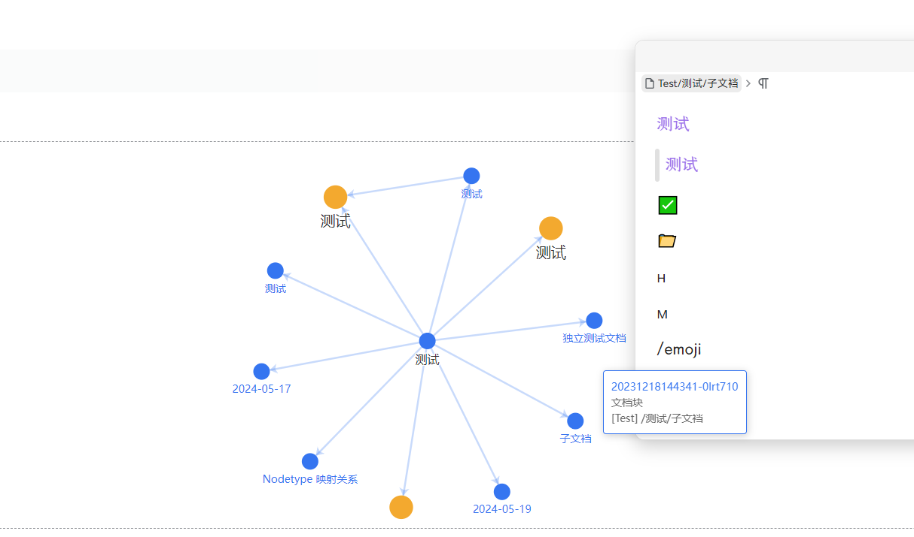​

### columns 和 rows

```js
columns(elements: HTMLElement[], options?: {
    gap?: string;
    flex?: number[];
}): HTMLDivElement;

rows(elements: HTMLElement[], options?: {
    gap?: string;
    flex?: number[];
}): HTMLDivElement;
```

可以通过 columns 和 rows 添加多列或者多行布局（基于 flex）。这两个组件需要传入 html 元素的列表， `options`​ 参数：

* ​`gap`​：多行或者多列之间的间距，默认 5px
* ​`flex`​：多行或者多列容器的比例，默认不指定表示等距

以下是一个多列布局的案例：

```js
//!js
let dv = Query.DataView(protyle, item, top);
dv.addcolumns([
  dv.md('## 第一列'),
  dv.md('## 第二列'),
  dv.rows([
      dv.md('## 第三列'),
      dv.md('第三列下方的内容\n{: style="background-color: pink"}'),
    ], { gap: '20px' }
  )
], { flex: [1, 1, 2]}); // flex 指定三列为 1:1:2 的比例
dv.render();
```

​​

### details

```ts
details(summary: string, content: string | HTMLElement)
```

details 用于创建一个折叠列表，第一个参数为列表的标题，后面的内容为列表内部的内容。

以下展示一个案例，随机查询若干块，并按照所在的笔记本进行分组，每一组的内容分别放入一个折叠列表中。

```js
//!js
const query = async () => {
    let dv = Query.DataView(protyle, item, top);
    let blocks = await Query.random(10);
    //使用 groupby 函数分组
    blocks.groupby('box', (boxid, group) => {
        const boxname = Query.utils.boxname(boxid);
        const ele = dv.list(group);
        dv.adddetails(boxname, ele);
    });
    dv.render();
}

return query();
```

​​

### addElement

```js
addElement(ele: HTMLElement | string, disposer?: () => void)
```

addElement 可以将一个外部创建的 element 元素作为自定义的视图加入 DataView 中。这个方法还有一个 `addele`​ 的别名。

> 🔔 如果你有大量添加自定义 element 的需求，推荐使用后面会讲到的「自定义视图组件」功能。

​`addele`​ 元素会自动将传入的元素封装为一个 View Container 元素。你可以通过 `returnedEle.dataset.id`​ 获取 container 的 ID。

### addDisposer

```js
addDisposer(dispose: () => void, id?: string)
```

addDisposer 接受一个回调函数作为参数，该函数将自动在 DataView 被销毁的时候运行。

> **被销毁**最直接的理解就是【点击刷新按钮重新查询嵌入块，并造成 DataView 的重绘】，具体细节请参考【理解 DataView 的生命周期】小节。

以下是一个案例：创建一个计时器，并且在刷新的时候销毁计时器。

```js
//!js
const query = async () => {
  let dv = Query.DataView(protyle, item, top);
  const span = document.createElement('span');
  span.innerText = 0;

  dv.addele(span);

  let timer = setInterval(() => {
      console.log(span.innerText);
      span.innerText = parseInt(span.innerText) + 1;
  }, 1000);

  dv.addDisposer(() => {
      console.log('dispose timer!');
      clearInterval(timer);
  });

  dv.render();
}

return query();
```

​​

### removeView

```js
removeView(id: string)
```

给定一个视图组件的 id (`container.dataset.id`​)，可以调用 `removeView`​ 方法将其删除。

如果组件自带 `dispose`​ 函数，则在删除之前会自动执行对应组件的 `dispose`​ 操作。

```js
//!js
const query = async () => {
    let dv = Query.DataView(protyle, item, top);
    const span = document.createElement('span');
    span.innerText = 0;

    //等价于上面的 addele + addDisposer 两步合在一起
    const eleId = (dv.addele(span, () => {
        console.log('dispose timer!');
        clearInterval(timer);
    })).dataset.id; //addElement 的别名

    let timer = setInterval(() => {
        console.log(span.innerText);
        span.innerText = parseInt(span.innerText) + 1;
    }, 1000);

    //删除组件的按钮
    const button = document.createElement('button');
    button.innerText = 'Remove';
    button.onclick = () => { dv.removeView(eleId); }
    dv.addele(button);

    dv.render();
}

return query();
```

​​

### replaceView

```js
replaceView(id: string, viewContainer: HTMLElement, disposer?: () => void)
```

* 给定一个视图组件的 id (`container.dataset.id`​)，可以调用 `replaceView`​ 方法将替换为另一个新的组件

* 如果被替换的旧组件自带 `dispose`​ 函数，则在被替换（实际上就是删除）之前会自动执行对应组件的 `dispose`​ 操作
* 可以传入一个 `disposer`​ 函数，作为组件附加的 `dispose`​ 函数（不过一般来说没有必要）

* 注意

  1. 传入的 viewContainer 必须同样是一个视图组件的 container 元素
  2. 传入的 viewContainer 在替换原来的组件的位置之后，其 `data-id`​ 将字段被修正为原本的 ID，而非传入前生成的新 ID

我们更改上面的案例，点击按钮后，在原本 counter 的地方显示删除的提示信息。

```js
//!js
const query = async () => {
    let dv = Query.DataView(protyle, item, top);
    const span = document.createElement('span');
    span.innerText = 0;
    const eleId = (dv.addele(span)).dataset.id; //addElement 的别名

    let timer = setInterval(() => {
        console.log(span.innerText);
        span.innerText = parseInt(span.innerText) + 1;
    }, 1000);

    dv.addDisposer(() => {
        console.log('dispose timer!');
        clearInterval(timer);
    }, eleId);

    const button = document.createElement('button');
    button.innerText = 'Replace';
    button.onclick = () => {
      let time = Query.utils.now();
      dv.replaceView(
        eleId,
        dv.md(`> ${time}: Old View Replaced`),
        () => {
          console.log('Dispose:', time);
        }
      );
    }
    dv.addele(button);

    dv.render();
}

return query();
```

​​

## 5. 进阶用法 - DataView 高级特性

### 自定义视图组件

插件会在 `/data/public`​ 目录下自动创建一个 `query-view.custom.js`​ 的脚本。利用这个脚本，你可以创建自己的自定义组件。脚本的默认

你可以在 custom 中编写你自己的组件：

```ts
/**
 * User customized view. If registered, you can use it inside DataView by `dv.xxx()` or `dv.addxxx()`
 */
interface ICustomView {
    /**
     * Use the custom view
     * @param dv - DataView instance, might be empty while validating process
     */
    use: (dv?: IDataView) => {
        render: (container: HTMLElement, ...args: any[]) => void | string | HTMLElement; //Create the user custom view.
        dispose?: () => void;  // Unmount hook for the user custom view.
    },
    alias?: string[]; // Alias name for the custom view
}

interface IUserCustom {
    [key: string]: ICustomView;
}
```

每个组件结构如下：

* ​`alias`​：可选，定义组件的别名
* ​`use`​：用来实现自定义组件的函数

  * **参数**：`dv`​，一个 `DataView`​ 的实例

    * 注意：`dv`​ 参数**可能传入一个 null**
    * 原因是插件在导入脚本的时候需要检查组件函数的结构是否正确，会传入一个 `null`​ 用于检查 `use`​ 的返回值
  * **返回**：

    * ​`render`​：必要返回值，该方法的第一个 `container`​ 参数为组件的容器元素，后面的参数则为组件调用的参数；你可以

      1. 在 render 中创建自己的元素并调用 `container.append`​ 将元素加入容器中
      2. 也可以返回自定义的元素（或者单纯的字符串），返回值会被默认加入到 container 中
    * ​`dispose`​：可选，如果你的组件有一些副作用需要清理，则必须返回这个参数，`dispose`​ 方法将在 DataView 被销毁的时候调用

以默认的 example 组件为例：

```js
const custom = {
    example: {
        use: () => {
            let state;
            return {
                render: (element, id) => {
                    console.log('init example custom view with id:', id);
                    state = id;
                    element.innerHTML = 'This is a example custom view ' + id;
                },
                dispose: () => {
                    console.log('dispose example custom view ' + state);
                }
            };
        },
        alias: ['Example', 'ExampleView']
    }
}

export default custom;
```

成功注册自定义组件之后，可以直接调用 `dv.example`​, `dv.addExampleView`​ 等。

```js
//!js
let dv = Query.DataView(protyle, item, top);
dv.addexample(`ID = ${Query.utils.date()}`);
dv.render();
```

​​

> 🔔 **注意**：`DataView`​ 会给所有的组件**自动添加他小写版本的别名**，所以两个名为 `Add`​ 和 `add`​ 的组件可能会一方覆盖另一方！

自定义的组件会在插件启动的时候自动导入，如果你在插件运行的过程当中更改了 js 文件，可以在设置面板或者顶栏菜单中点击「**重新导入**」的按钮更新组件的状态。

### DataView.useState

> 🔔 **注意**：`useState`​ 为一个实验性的高级功能，目前的测试样例还不足以完全保证在多端同步的情况下不会出现任何问题。<u>不推荐</u>没有编程经验背景的新人（大量）使用！

嵌入块在每次打开文档、点击刷新按钮的时候，都会自动重绘（repaint），意味着每次 DataView 都会从头开始，是一个**无状态**的视图。

​`dv.useState`​ 方法为 DataView 提供了一些**持久化**的功能，该方法会返回一个 `State`​ 对象。他有两种使用的风格：类似 `signal`​ 的 `getter/setter`​ 风格和类似 `vue`​ 的 `.value`​ 风格。

```js
const state = dv.useState('keyname', 1); //key, default value
//获取当前状态
state();
state.value;
//更新状态
state(2)
state.value = 2;
```

每个 state 都会在嵌入块刷新的时候，会将当前的状态**写入缓存**并最终**保存到块的自定义属性**当中，从而实现状态的持久化。

以下是一个案例，你可以不断的点击按钮，左侧的数目会一直增长。

```js
//!js
let dv = Query.DataView(protyle, item, top);
const state = dv.useState('counter', 1);
const button = document.createElement('button');
button.textContent = '+1';
button.onclick = (e) => {
    state.value += 1; //更新状态, 等价于 state(state() + 1)
    dv.repaint(); // repaint 用于主动触发嵌入块的重绘
}
dv.addcols([button, dv.md(`State = ${state()}`)]); //等价于使用 state.value

dv.render();
```

现在：<u>关闭当前的文档，然后重新打开</u>，你会发现嵌入块的内容依然是这个数值。再打开嵌入块的属性面板，会发现名为 `counter`​ 的 state 已经保存到自定义属性中。

​​

以下给出一个「每日一句」的案例：

* 通过网络 API 每天获取一个句子
* 通过 state 保存这个句子，并保证这一天一直显示这一句话

```js
//!js
let dv = Query.DataView(protyle, item, top);
const today = Query.Utils.today();
const state = dv.useState(today);
//如果 state 存在，就用之前的缓存
if (state()) {
  dv.addmd('今天的每日一句')
  dv.addmd(`> ${state()}`)
} else {
//注：受到网络环境的影响，你在运行的时候可能不一定能访问这个 API
fetch('https://api.xygeng.cn/one').then(async ans => {
 console.log(ans)
 if (ans.ok) {
    let data = await ans.json();
    console.log(data)
    //更新 state
    state.value = `${data.data.content} —— ${data.data.origin}`;
    dv.addmd('今天的每日一句')
    dv.addmd(`> ${state.value}`)
 }
});
}
dv.render();
```

由于我们使用了时间戳作为 state key，所以如果你多运行几天再打开属性面板，会发现每天的一句话都保存在这里。

​​

#### state 的更新写入机制（技术细节，可跳过）

> 🔔 state 是一个实验性的功能，我也不知道是否会引发奇怪的问题。如果你在使用的过程中遇到了问题，可以参考这一小节。

DataView 的 state 采用了缓存 + 块属性存储的方式进行持久化。

1. **缓存**：当停留在文档页面中的时候，state 会写入到 Session Storage 的缓存中，即使每次调用 `state()`​ 更新状态或者触发嵌入块重绘，也只会更改 Session 缓存中的 state 数据
2. **文档级写入**：当一个文档被关闭的时候，文档内所有嵌入块用到的 state 会写入到块属性中，并从 Session Storage 缓存中删除对应文档中的缓存
3. **全部写入**：当插件被禁用或者桌面端的窗口被关闭（准确来说是监听了右上角 X 按钮的点击事件）的时候，所有缓存中的 State 会被写入块属性中，并清空全部 Session Storage 中缓存的 state

🤔 **为什么要这么做，而不是每次在代码中更新 state 的时候，直接保存到块属性中？**

* 次要的原因是：为了防止过于频繁的块更新操作（当然这个可以通过 debounce 来解决）。
* **首要原因**是：防止在多端同步的情况下出现**数据冲突**乃至地狱的“**循环冲突**”的情况

以下是一个案例来解释什么是“**循环冲突**”。

案例：考虑这种 DataView

```js
//!js
const dv = Query.DataView(protyle, item, top);
const cnt = dv.useState('counter', 1);
dv.addmd(`${cnt()} --> ${cnt() + 1}`);
cnt.value += 1;
dv.render();
```

假如有两个设备 A，B，同时打开了这个文档的嵌入块，**假如**实时更新块属性的话就会触发窒息般的“**循环冲突**”。

1. 设备 A 更新了状态后，数据同步到云端
2. 假设设备 B 开启了同步感知，则会自动更新数据；并且由于所在的文档状态发生变化，会触发文档级别的重绘——进而导致 B 中嵌入块的重绘
3. 但是一旦 B 的嵌入块重绘，就会自动更新 counter 状态，于是 B 中嵌入块的状态就和云端更新下来的数据产生冲突——具体表现为生成一个冲突文档
4. 由于 B 的状态发生了变化，所以同样会同步到云端
5. 此时如果 A 开启同步感知，也会触发文档重绘，同样会出现更新的嵌入块状态和云端数据状态发生冲突的情况
6. 以上过程如果不进行人为干预阻止，<u>可以无限重复下去，双方依次不断地生成一个又一个冲突文档</u>……

可以看到，引发冲突的最直接的问题是：思源在同步文档后会触发重绘，而重绘会引发块状态的自动更新。

🙁 所以为了避免这种循环冲突的发生，state 在文档内更新的时候只会写入缓存，不会更改块的状态；只有文档被关闭了、确认不会引发冲突性的重绘的时候，才会写入到块属性中。

### 理解 DataView 的生命周期（技术细节，可跳过）

1. **创建实例**：当打开文档，或者文档动态加载到嵌入块的时候，嵌入块的代码会自动运行；此时就会触发 DataView 的构造函数，并创建 dv 实例

    * **恢复组件状态**：首先尝试从 `SessionStorage`​ 中查找组件缓存的状态，如果不存在则解析嵌入块的块属性并从 Element 属性中恢复组件状态
    * **注册组件**：在 DataView 创建的过程中，会注册内置的组件和外部导入的组件，注册完毕之后，将可以通过 `dv.addxxx`​ 来构造视图组件
2. ​**​`dv.addxxx`​**​：在嵌入块代码中，逐行调用 `dv.addxxx()`​ 函数，依次调用各个组件

    * 对于副作用的组件，会在 `dv`​ 实例中注册 `dispose`​ 回调函数用于在销毁的时候清理副作用
3. **状态更新**：在嵌入块运行过程中，如果调用了 `dv.useState`​ 并更新了状态，将会把最新的状态缓存到 SessionStorage 当中
4. ​**​`dv.render`​**​：

    * 绑定当前嵌入块的元素，截断部分事件冒泡
    * 注册 render 函数中相关副作用的 `dispose`​ 回调函数
    * 监控当前嵌入块的状态
5. **重绘嵌入块**：

    * **触发条件**：当嵌入块代码更新、用户点击刷新的时候，思源将销毁 DataView 所在的嵌入块内容
    * **Dispose**：检测到嵌入块被销毁，当前 DataView 已经失效，调用所有 `dispose`​ 回调函数清理 DataView 的副作用
    * **接下来回到状态 1**，重新创建新的实例
6. **生命周期结束**

    * **触发条件**：嵌入块所在的文档被关闭、思源桌面端窗口被关闭、window 被重载或者插件被禁用
    * **Finalize**：1）调用 DataView 的 dispose 操作；2）读取 SessionStorage 内相关的 DataView 的状态写入到嵌入块属性中；3）清理 SessionStorage 缓存

### ⚠️ 一些建议

1. **不建议**在 DataView 里写**大量的交互**！

    * 尽管在提供的 API 等方面并没有禁止用户编写交互性的视图组件（例如输入框，按钮等）；但请注意：DataView 被设计为一个 **「理论上只读」** 的元素、一个嵌入在文档中的 DashBoard
    * **核心矛盾**在于：思源编辑器本身就会监听各种用户输入事件，而 DataView 中用户输入事件如果错误地传递到思源的监听器中，可能造成风险
    * DataView 内部会阻止一些常见事件的冒泡，但是也不能排除一些特殊的意外情况

      ```js
      const EVENTS_TO_STOP = [
          'compositionstart', 'compositionend',
          'mousedown', 'mouseup', 'keydown', 'keyup', 'input',
          'copy', 'cut', 'paste'
      ];
      ```
    * 如果你在编写自定义的 dv 的过程中，发现了和用户输入相关的异常情况，你最好停下来，不要再继续尝试，以免对重要数据造成不良影响
2. <u>多端设备同步情况下</u>，使用 useState 要小心，建议开启「**设置-云端-生成冲突文件**」​

    ​​

    目前 state 功能虽然规避了「冲突地狱」的问题，但是在**一些特殊的多端同步情况下仍然可能出现数据冲突的情况**。

    为了避免出现数据状态丢失，建议在思源的同步设置中开启「生成冲突文档」的设置，这样则遇到问题的时候还可以手动处理。

## 6. 在外部编辑器中编辑代码

思源内置的嵌入块悬浮窗并不好用，在编辑略微复杂的代码的时候体验非常差劲。因此插件提供了在外部编辑器中打开 js 代码的功能。

 **⚠️ 注意！本功能仅在桌面端可用。**

用户需要在插件设置中配置外部编辑器打开的默认参数：

​​

默认为 `code -w {{filepath}}`​，代表会使用 VsCode （请将 `code`​ 添加到环境变量中）来打开。其中 `{{filepath}}`​ 会在运行时被替换为实际的临时代码文件的路径。

使用的时候，需要在块的插件菜单中点击“Edit Code”按钮。

​​

插件会自动在本地创建一个临时的代码文件，然后在使用上述命令打开代码文件。插件会**跟踪代码文件的编辑更新**并将文件中最新的内容更新到嵌入块中，并刷新渲染嵌入块的内容。

​​

常见代码编辑器的命令行参考：

* vscode

  [https://code.visualstudio.com/docs/editor/command-line](https://code.visualstudio.com/docs/editor/command-line)
* sublime

  [https://www.sublimetext.com/docs/command_line.html](https://www.sublimetext.com/docs/command_line.html)

## 7. 其他使用建议

### 如何 Debug DataView 的代码？

你可以在在代码中添加 `debugger`​，然后打开开发者模式。当运行到这一行的时候，就会自动进入断点模式，然后就可以调试程序了。

​​

### 配合思源模板使用

你可以将调试好的嵌入块代码放入 `template/`​ 下的模板文件中，这样对于常用的查询模板都可以快速调用：

​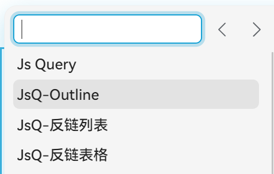​

使用模板还有一个好处是，可以使用一些模板提供的变量，例如下面这个模板中，使用了 `$datestr_sy`​ 变量，用来查询今天创建的文档。

```markdown
.action{$datestr := now | date "2006-01-02"}
.action{$datestr_sy := now | date "20060102"}

{{//!js_esc_newline_const today = '.action{$datestr_sy}';_esc_newline_const query = async () => {_esc_newline_  let dv = Query.Dataview(protyle, item, top);_esc_newline_  let blocks = await Query.sql(`_esc_newline_    select * from blocks where type='d' and created like '${today}%'_esc_newline_  `);_esc_newline_  dv.addList(blocks, { type: 'o', columns: 2 });_esc_newline_  dv.render();_esc_newline_}_esc_newline_return query();}}
```

同样的功能虽然也能用 `Query.Utils.today()`​ 来实现，但是由于嵌入块每天都会刷新，如果想要固定显示某一天创建的文档，要么手动填写 `today`​ 变量，要么使用 `state`​ 功能在第一次的时候直接保存日期信息。

不过模板 markdown 文件中的嵌入块代码必须以单行模式编写，每个换行符都需要替换为 `_esc_newline_`​，非常不方便转换。

插件在块菜单中提供了一个按钮，可以直接进行上述转换。你可以直接复制弹出窗口中的代码，粘贴到 template 文件中使用。

​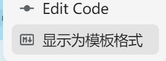​

​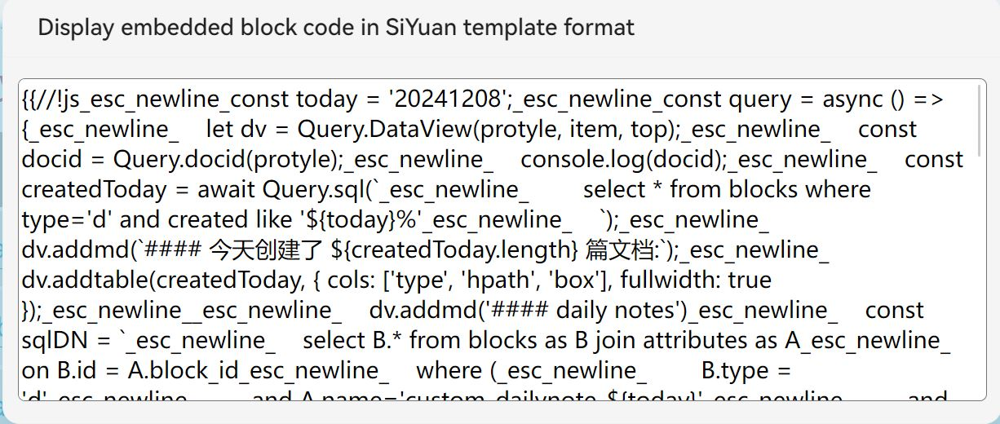​

## 完整 API

> 注：由于接口文件会随着开发而变动，所以 README 本体中并不包含 interface 代码，而是放了一些 placeholder 。然后在编译运行时，将自动生成的接口代码替换到打包文件的 README 文件里面。
>
> 最新的完整的接口文件，请访问 [https://github.com/frostime/sy-query-view/blob/main/public/types.d.ts](https://github.com/frostime/sy-query-view/blob/main/public/types.d.ts) 获取。
>
> 你还可以在下载插件之后，在左上角的菜单按钮中点击“下载 d.ts”获取当前版本的 types 文件。
>
> ​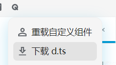​

### Query

```ts
{{Query}}
```

### DataView

```ts
{{DataView}}
```

### IWrapBlock & IWrapList

```ts
{{Proxy}}
```

## 案例演示

提供了一些 example 代码。部分案例在上面的文档中其实已经出现过了。

以下的案例代码均会随插件下载到本地，你可以：在 `plugins/sy-query-view/example`​ 中查看这些脚本。

💡 当然更方便的是，在在左上角插件的菜单中点击「Examples」在新的标签页中查看样例代码。

​​

### 展示当前文档的反向链接表格

源代码参见：[https://github.com/frostime/sy-query-view/blob/main/public/example/exp-doc-backlinks-table.js](https://github.com/frostime/sy-query-view/blob/main/public/example/exp-doc-backlinks-table.js)

​​

### 展示当前文档的大纲

源代码参见：[https://github.com/frostime/sy-query-view/blob/main/public/example/exp-outline.js](https://github.com/frostime/sy-query-view/blob/main/public/example/exp-outline.js)

​​

### 统计当天今天的文档

源代码参见：[https://github.com/frostime/sy-query-view/blob/main/public/example/exp-today-updated.js](https://github.com/frostime/sy-query-view/blob/main/public/example/exp-today-updated.js)

这个案例中，使用 `state`​ 来存储日期信息，过了今天之后，表格的内容将一直保持不变而非获取未来某天更新的文档。

​​

### 创建文档的变化曲线

源代码参见：[https://github.com/frostime/sy-query-view/blob/main/public/example/exp-created-docs.js](https://github.com/frostime/sy-query-view/blob/main/public/example/exp-created-docs.js)

​​

### SQL 查询器

源代码参见：[https://github.com/frostime/sy-query-view/blob/main/public/example/exp-sql-executor.js](https://github.com/frostime/sy-query-view/blob/main/public/example/exp-sql-executor.js)

​​

### ChatGPT

源代码参见：[https://github.com/frostime/sy-query-view/blob/main/public/example/exp-gpt-chat.js](https://github.com/frostime/sy-query-view/blob/main/public/example/exp-gpt-chat.js)

> 这个代码用到了一个上面没有提到的 `Query.gpt`​ 的 API，具体用法请参考 d.ts 文件

​​
